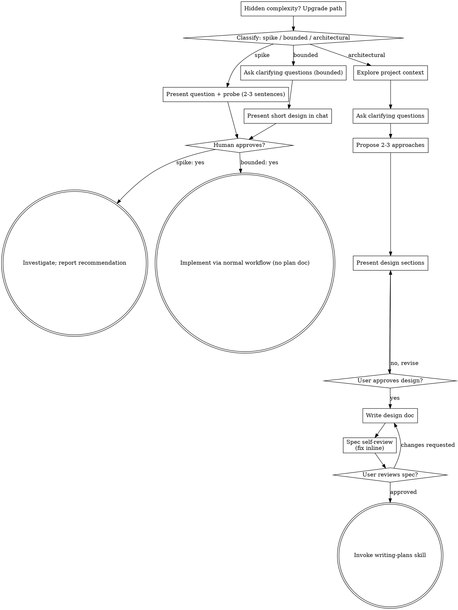

# 2026-09-06 — M0 环境检查与计划书起草

> 会话 ID `4336ed50`｜队员消息 3 条 / AI 回复 7 条
> **AI 回复已截断至 600 字符**，完整原文见 `原始记录/4336ed50*.jsonl`。
> 时间戳为 UTC（本地为 +8 小时）。

---

**[2026-09-06 12:56] 队员：**

我想动手实现一个简易能跑的操作系统内核,帮我检查一下相关编译环境,确认无误后帮我拟草一份计划书

**[2026-09-06 12:56] AI：**

我先按流程调用 brainstorming 技能来梳理需求,因为"动手实现一个能跑的操作系统内核"是一个需要先明确目标架构、范围和设计的创作型任务。

**[2026-09-06 12:56] 队员：**

Base directory for this skill: C:\Users\a'a'a\.claude\plugins\cache\claude-plugins-official\superpowers\6.3.0\skills\brainstorming

# Brainstorming Ideas Into Designs

Help turn ideas into fully formed designs and specs through natural collaborative dialogue.

Start by classifying how much process the request needs, then work
through your path: understand the context, refine the idea, present a
design, and get your human partner's approval.

<HARD-GATE>
Do NOT invoke any implementation skill, write any code, scaffold any
project, or take any implementation action until you have told your
human partner what you intend and they have approved it. This applies
to EVERY task on EVERY path below — the ceremony scales with the task;
the approval gate never does.
</HARD-GATE>

## Three Paths

Before your first question, classify the request and say the
classification out loud — "this looks bounded, so I'll present a short
design here rather than write a spec" — so your human partner can
override it:

- **Spike** — a feasibility question ("can we...", "is it possible...",
  "quick and dirty is fine") whose output is an answer, not code you
  keep. Present the question and what you'll try in 2-3 sentences, get
  a nod, then find out as cheaply as correctness allows. No design
  doc, no spec file. Report findings as a recommendation; anything you
  built stays labeled throwaway.
- **Bounded** — a well-scoped change to code that already exists in
  this repo: a new flag, a small endpoint, a one-file fix.
  Understanding the kind of app is not enough — bounded means the flow
  you are changing is already here to read. If there is no existing
  flow to change, the task is not bounded. Ask the clarifying
  questions that matter, present a short design IN CHAT (a few
  sentences to a few short paragraphs), and STOP. Implementation
  starts only after your human partner says yes to that design — a
  bounded task's approval is as hard a gate as an architectural
  one. No spec file, no implementation plan document.
- **Architectural** — new projects, new subsystems, changes that
  restructure how components fit together or alter interfaces others
  depend on. Follow the full process: questions, approaches, sectioned
  design, written spec, then the writing-plans skill.

When in doubt between two paths, take the heavier one. The ratchet is
one-way: hidden complexity discovered mid-task upgrades the path —
stop, say so, and step up. Nothing downgrades mid-task.

## Anti-Pattern: "Too Simple To Need Approval"

Every path ends with your human partner approving your intent before
implementation. A todo list, a single-function utility, a config
change — the design may be two sentences in chat, but you MUST present
it and get approval. "Simple" tasks are where unexamined assumptions
cause the most wasted work. What scales with simplicity is the
artifact, never the approval.

## Red Flags

| Thought | Reality |
|---------|---------|
| "This is too simple to need a design" | Simple means a short design, not no design. Two sentences in chat, then approval. |
| "I'll call it bounded and skip the spec" | Reaching for a label to skip work IS the doubt — take the heavier path. |
| "It's bounded and the design is obvious — I'll start while they read it" | The gate is the approval, not the design's length. Present, then stop until you hear yes. |
| "I understand this kind of app, so it's bounded" | Bounded measures the repo, not your familiarity. A new project has no existing flow — it is architectural. |
| "The spike works, so I'll keep the code" | A spike's output is an answer. Keeping the code is a new request — classify it. |
| "It grew, but I'm almost done — no need to re-classify" | Hidden complexity upgrades the path mid-task. Stop and say so. |
| "They approved the spike, so the follow-up change is approved too" | Each task gets its own classification and its own approval. |

## Checklist

Classify first, announce the path, then create a task for each item on
your path and complete them in order.

**Spike:**
1. **Explore project context** — enough to frame the probe
2. **Present question + probe plan** — 2-3 sentences
3. **Get approval** — a nod is enough
4. **Investigate** — as cheaply as correctness allows
5. **Report findings** — a recommendation; label anything built as throwaway

**Bounded:**
1. **Explore project context** — check files, docs, recent commits
2. **Ask clarifying questions** — one at a time, the ones that matter
3. **Present short design in chat** — approach, files touched, testing
4. **Get approval** — STOP and wait for an explicit yes; presenting the design and starting in the same breath is skipping the gate
5. **Implement** — proceed with the normal development workflow (TDD applies); no plan document

**Architectural:**
1. **Explore project context** — check files, docs, recent commits
2. **Offer the visual companion just-in-time** — NOT upfront. The first time a question would genuinely be clearer shown than described, offer it then (its own message); on approval its browser tab opens for you. If no visual question ever arises, never offer it. See the Visual Companion section below.
3. **Ask clarifying questions** — one at a time, understand purpose/constraints/success criteria
4. **Propose 2-3 approaches** — with trade-offs and your recommendation
5. **Present design** — in sections scaled to their complexity, get user approval after each section
6. **Write design doc** — save to `docs/superpowers/specs/YYYY-MM-DD-<topic>-design.md` and commit
7. **Spec self-review** — quick inline check for placeholders, contradictions, ambiguity, scope (see below)
8. **User reviews written spec** — ask user to review the spec file before proceeding
9. **Transition to implementation** — invoke writing-plans skill to create implementation plan

## Process Flow



**Terminal states are path-bound.** Architectural: the ONLY skill you
invoke after brainstorming is writing-plans — never frontend-design,
mcp-builder, or any other implementation skill. Bounded: after
approval, implementation proceeds directly through the normal
development workflow; no plan document. Spike: the terminal state is a
reported recommendation.

## The Process

The subsections below serve the bounded and architectural paths (a
spike stops at "present the probe, get a nod"). Sections from
**Exploring approaches** onward are architectural-path depth — for
bounded work, context plus a few questions plus a short in-chat design
is the whole process.

**Understanding the idea:**

- Check out the current project state first (files, docs, recent commits)
- Before asking detailed questions, assess scope: if the request describes multiple independent subsystems (e.g., "build a platform with chat, file storage, billing, and analytics"), flag this immediately. Don't spend questions refining details of a project that needs to be decomposed first.
- If the project is too large for a single spec, help the user decompose into sub-projects: what are the independent pieces, how do they relate, what order should they be built? Then brainstorm the first sub-project through the normal design flow. Each sub-project gets its own spec → plan → implementation cycle.
- For appropriately-scoped projects, ask questions one at a time to refine the idea
- Prefer multiple choice questions when possible, but open-ended is fine too
- Only one question per message - if a topic needs more exploration, break it into multiple questions
- Focus on understanding: purpose, constraints, success criteria

**Exploring approaches:**

- Propose 2-3 different approaches with trade-offs
- Present options conversationally with your recommendation and reasoning
- Lead with your recommended option and explain why
- YAGNI ruthlessly - remove unnecessary features from every approach and design

**Presenting the design:**

- Once you believe you understand what you're building, present the design
- Scale each section to its complexity: a few sentences if straightforward, up to 200-300 words if nuanced
- Ask after each section whether it looks right so far
- Cover: architecture, components, data flow, error handling, testing
- Be ready to go back and clarify if something doesn't make sense

**Design for isolation and clarity:**

- Break the system into smaller units that each have one clear purpose, communicate through well-defined interfaces, and can be understood and tested independently
- For each unit, you should be able to answer: what does it do, how do you use it, and what does it depend on?
- Can someone understand what a unit does without reading its internals? Can you change the internals without breaking consumers? If not, the boundaries need work.
- Smaller, well-bounded units are also easier for you to work with - you reason better about code you can hold in context at once, and your edits are more reliable when files are focused. When a file grows large, that's often a signal that it's doing too much.

**Working in existing codebases:**

- Explore the current structure before proposing changes. Follow existing patterns.
- Where existing code has problems that affect the work (e.g., a file that's grown too large, unclear boundaries, tangled responsibilities), include targeted improvements as part of the design - the way a good developer improves code they're working in.
- Don't propose unrelated refactoring. Stay focused on what serves the current goal.

## After the Design (architectural path)

**Documentation:**

- Write the validated design (spec) to `docs/superpowers/specs/YYYY-MM-DD-<topic>-design.md`
  - (User preferences for spec location override this default)
- Use elements-of-style:writing-clearly-and-concisely skill if available
- Commit the design document to git

**Spec Self-Review:**
After writing the spec document, look at it with fresh eyes:

1. **Placeholder scan:** Any "TBD", "TODO", incomplete sections, or vague requirements? Fix them.
2. **Internal consistency:** Do any sections contradict each other? Does the architecture match the feature descriptions?
3. **Scope check:** Is this focused enough for a single implementation plan, or does it need decomposition?
4. **Ambiguity check:** Could any requirement be interpreted two different ways? If so, pick one and make it explicit.

Fix any issues inline. No need to re-review — just fix and move on.

**User Review Gate:**
After the spec review loop passes, ask the user to review the written spec before proceeding:

> "Spec written and committed to `<path>`. Please review it and let me know if you want to make any changes before we start writing out the implementation plan."

Wait for the user's response. If they request changes, make them and re-run the spec review loop. Only proceed once the user approves.

**Implementation:**

- Invoke the writing-plans skill to create a detailed implementation plan
- Do NOT invoke any other skill. writing-plans is the next step.

## Visual Companion

A browser-based companion for showing mockups, diagrams, and visual options during brainstorming. Available as a tool — not a mode. Accepting the companion means it's available for questions that benefit from visual treatment; it does NOT mean every question goes through the browser.

**Offering the companion (just-in-time):** Do NOT offer it upfront. Wait until a question would genuinely be clearer shown than told — a real mockup / layout / diagram question, not merely a UI *topic*. The first time that happens, offer it then, as its own message:
> "This next part might be easier if I show you — I can put together mockups, diagrams, and comparisons in a browser tab as we go. It's still new and can be token-intensive. Want me to? I'll open it for you."

**This offer MUST be its own message.** Only the offer — no clarifying question, summary, or other content. Wait for the user's response. If they accept, start the server with `--open` so their browser opens to the first screen automatically. If they decline, continue text-only and don't offer again unless they raise it.

**Per-question decision:** Even after the user accepts, decide FOR EACH QUESTION whether to use the browser or the terminal. The test: **would the user understand this better by seeing it than reading it?**

- **Use the browser** for content that IS visual — mockups, wireframes, layout comparisons, architecture diagrams, side-by-side visual designs
- **Use the terminal** for content that is text — requirements questions, conceptual choices, tradeoff lists, A/B/C/D text options, scope decisions

A question about a UI topic is not automatically a visual question. "What does personality mean in this context?" is a conceptual question — use the terminal. "Which wizard layout works better?" is a visual question — use the browser.

If they agree to the companion, read the detailed guide before proceeding:
`skills/brainstorming/visual-companion.md`

**[2026-09-06 12:56] AI：**

这是一个**新建项目**(D:\8GodOS 目前不是 git 仓库,应该是空目录),属于 **architectural(架构级)** 任务。 在走完整需求梳理之前,我先做你明确要求的**编译环境检查**——这属于事实收集,不涉及写代码,不影响后面的批准门槛。让我并行探测工具链。

**[2026-09-06 12:57] AI：**

环境初查结果已经出来了。先记录关键事实,再补两个探测(因为 WSL 输出出现了乱码,我需要确认它是否真的可用;以及 Windows 侧有没有包管理器作为备选)。

**[2026-09-06 12:58] AI：**

环境检查完成。结果如下: ## 编译环境检查结果 **Windows 原生侧(当前 Git Bash)** | 工具 | 状态 | 说明 | |------|------|------| | gcc | ✅ 8.1.0 | 但是 MinGW-W64,输出 **PE** 格式,不能直接编内核(需 ELF) | | ld / objdump | ✅ 2.30 | MinGW binutils,同样面向 PE | | gdb | ✅ 8.1 | 可用 | | nasm / make / qemu | ❌ 缺失 | 都没有 | | 交叉编译器 (i686/x86_64-elf-gcc) | ❌ 缺失 | 没有 | | winget | ✅ 1.29 | 可装 Windows 版 QEMU/NASM | **WSL2 Ubuntu 侧(推荐在这里做)** | 工具 | 状态 | |------|------| | 发行版 | ✅ Ubuntu 24.04 + docker-desktop,内核 6.18.33 WSL2 | | gcc | ✅ **13.3.0**(原生 Linux,输出 ELF,可直接编内核) | | make | ✅ 4.3 | | ld | ✅ 2.42 | | nasm / qemu-system-x86 | ❌ 缺失,`apt install` 一条命令补齐 | # …（完整内容见原始记录）

**[2026-09-06 13:13] AI：**

收到,方案要素已锁定:**64 位 x86_64 + GRUB/Multiboot2 + 最小可启动(进入长模式后 VGA 打印 "Hello, kernel!")+ C 语言**。 下面是设计草案,请你过目确认后,我再落成《计划书》文件。 ## 设计草案 ### 1. 总体启动流程(架构) ``` BIOS → GRUB(从 ISO 读 Multiboot2 头,加载内核 ELF,进入 32 位保护模式) → _start(汇编:校验 multiboot2 魔数/指针 → 建页表 → 开 PAE+长模式 → 开分页 → 跳 64 位段) → _start64(汇编:设栈、清 .bss → call kmain) → kmain(C:写 VGA 文本缓冲区 0xB8000 打印 "Hello, kernel!" → hlt 死循环) ``` ### 2. 目录结构(最小,先跑通闭环) ``` D:\8GodOS\ ├── src/ │ ├── boot.asm # Multiboot2 头 + 长模式切换(32→64 位)+ 入口 │ ├── linker.ld # 链接脚本(把内核固定放在低 2MB,便于恒等映射) │ └── kernel.c # kmain + VGA 打印函数 ├── grub/grub.cfg # ISO 的 GRUB 菜单 ├── Makefile #  …（完整内容见原始记录）

**[2026-09-06 13:14] 队员：**

在WSL的Ubuntu做

**[2026-09-06 13:15] AI：**

收到,环境确定在 **WSL2 Ubuntu**。我这就把设计落成《计划书》文件。

**[2026-09-06 13:18] AI：**

《计划书》已写入 `D:\8GodOS\计划书.md`。要点回顾: - **环境结论**:WSL2 Ubuntu 里 gcc 13.3 / make / ld 已就绪,只差 `nasm`、`qemu-system-x86`、`grub-mkrescue`(一次 `apt install` 补齐);Windows 原生 MinGW gcc 因是 PE 目标,弃用。 - **技术路线**:x86_64 长模式 + GRUB/Multiboot2 + C,最小目标 = VGA 打印 `Hello, kernel!`。 - **里程碑**:M0 环境 → M1 能引导 → M2 进长模式 → M3 VGA 打印(达成总目标)→ M4 `make run` 一键启动。 - **含**:完整编译/打包/运行命令、multiboot2 常量、长模式切换序列(顺序不可错)、GDT 要点、风险对照表、后续方向。 文档里有一个我在聊天里笔误后已在正文修正的细节:`-mcmodel=large`(恒等映射用这个),不是 `-mcmodel=kernel`(那个是高半区才用)。 两件事等你确认: 1. **计划书**请过目一遍,有要改的地方告诉我(比如里程碑粒度、要不要加高半区、要不要把项目放 WSL 原生路径 `~/osdev` 而不是 `/mnt/d/8GodOS`)。 2. 确认后我就可以**开始  …（完整内容见原始记录）
