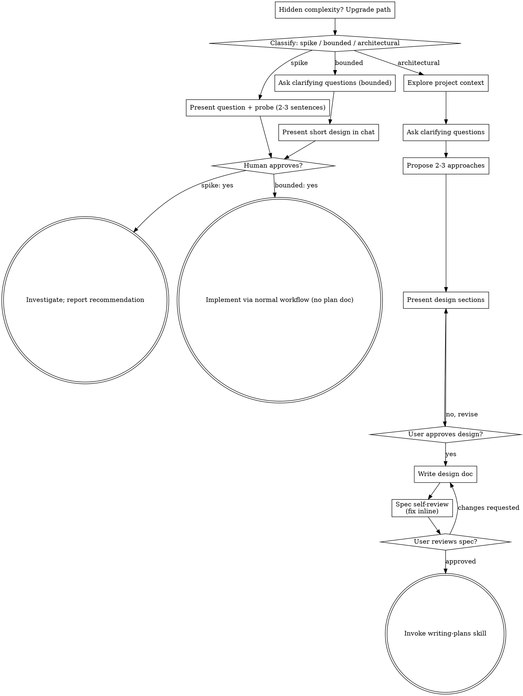

# 2026-09-15 — M5 完成(AI 整写 vga.c)

> 会话 ID `f8e6eaac`｜队员消息 23 条 / AI 回复 62 条
> **AI 回复已截断至 600 字符**，完整原文见 `原始记录/f8e6eaac*.jsonl`。
> 时间戳为 UTC（本地为 +8 小时）。

---

**[2026-09-15 11:40] 队员：**

看看现在M5还有多少没完成?

**[2026-09-15 11:40] AI：**

API Error: Unable to connect to API: Self-signed certificate detected. Check your proxy or corporate SSL certificates

**[2026-09-15 11:41] 队员：**

继续

**[2026-09-15 11:42] AI：**

看完了。M5 的功能代码只剩**硬件光标**这一块,其余是验证和收尾。 ## 已完成 ✅ | 项 | 位置 | |---|---| | VGA 拆成独立模块 | `src/vga.c` / `src/vga.h`(已提交 3ae7d49) | | `vga_scroll()` 整屏上滚 | `src/vga.c:14`,第 1~24 行上移 + 清最后一行 | | `\n` 行满自动滚 | `src/vga.c:24` `vga_newline()` 里 `row >= 25` 就滚,`row` 收回 24 | | `\t` 越界堵住 | `src/vga.c:54-57`,顶到 80 时走 `newline` 而不是直接写 | | `\b` 行首保护 | `src/vga.c:58`,col>0 才减 | | `vga_clear()` 循环体外的行/列复位 | `src/vga.c:39-40`(原来是循环内冗余写) | ## 没完成 ❌ **1. 硬件光标(唯一剩下的功能性代码)** `grep` 全仓只有 `src/io.h:6` 的 `outb` 定义,没有任何地方操作 `0x3D4`/`0x3D5`,也没有 `vga_update_cursor()`。现在 `vga.c:2` `#include "io.h"` 是空转的——正好是你准备接的地方。`vga.h` 的接口列 …（完整内容见原始记录）

**[2026-09-15 11:52] 队员：**

接下来该怎么做?

**[2026-09-15 11:52] 队员：**

Base directory for this skill: C:\Users\a'a'a\.claude\plugins\cache\claude-plugins-official\superpowers\6.3.0\skills\brainstorming

# Brainstorming Ideas Into Designs

Help turn ideas into fully formed designs and specs through natural collaborative dialogue.

Start by classifying how much process the request needs, then work
through your path: understand the context, refine the idea, present a
design, and get your human partner's approval.

<HARD-GATE>
Do NOT invoke any implementation skill, write any code, scaffold any
project, or take any implementation action until you have told your
human partner what you intend and they have approved it. This applies
to EVERY task on EVERY path below — the ceremony scales with the task;
the approval gate never does.
</HARD-GATE>

## Three Paths

Before your first question, classify the request and say the
classification out loud — "this looks bounded, so I'll present a short
design here rather than write a spec" — so your human partner can
override it:

- **Spike** — a feasibility question ("can we...", "is it possible...",
  "quick and dirty is fine") whose output is an answer, not code you
  keep. Present the question and what you'll try in 2-3 sentences, get
  a nod, then find out as cheaply as correctness allows. No design
  doc, no spec file. Report findings as a recommendation; anything you
  built stays labeled throwaway.
- **Bounded** — a well-scoped change to code that already exists in
  this repo: a new flag, a small endpoint, a one-file fix.
  Understanding the kind of app is not enough — bounded means the flow
  you are changing is already here to read. If there is no existing
  flow to change, the task is not bounded. Ask the clarifying
  questions that matter, present a short design IN CHAT (a few
  sentences to a few short paragraphs), and STOP. Implementation
  starts only after your human partner says yes to that design — a
  bounded task's approval is as hard a gate as an architectural
  one. No spec file, no implementation plan document.
- **Architectural** — new projects, new subsystems, changes that
  restructure how components fit together or alter interfaces others
  depend on. Follow the full process: questions, approaches, sectioned
  design, written spec, then the writing-plans skill.

When in doubt between two paths, take the heavier one. The ratchet is
one-way: hidden complexity discovered mid-task upgrades the path —
stop, say so, and step up. Nothing downgrades mid-task.

## Anti-Pattern: "Too Simple To Need Approval"

Every path ends with your human partner approving your intent before
implementation. A todo list, a single-function utility, a config
change — the design may be two sentences in chat, but you MUST present
it and get approval. "Simple" tasks are where unexamined assumptions
cause the most wasted work. What scales with simplicity is the
artifact, never the approval.

## Red Flags

| Thought | Reality |
|---------|---------|
| "This is too simple to need a design" | Simple means a short design, not no design. Two sentences in chat, then approval. |
| "I'll call it bounded and skip the spec" | Reaching for a label to skip work IS the doubt — take the heavier path. |
| "It's bounded and the design is obvious — I'll start while they read it" | The gate is the approval, not the design's length. Present, then stop until you hear yes. |
| "I understand this kind of app, so it's bounded" | Bounded measures the repo, not your familiarity. A new project has no existing flow — it is architectural. |
| "The spike works, so I'll keep the code" | A spike's output is an answer. Keeping the code is a new request — classify it. |
| "It grew, but I'm almost done — no need to re-classify" | Hidden complexity upgrades the path mid-task. Stop and say so. |
| "They approved the spike, so the follow-up change is approved too" | Each task gets its own classification and its own approval. |

## Checklist

Classify first, announce the path, then create a task for each item on
your path and complete them in order.

**Spike:**
1. **Explore project context** — enough to frame the probe
2. **Present question + probe plan** — 2-3 sentences
3. **Get approval** — a nod is enough
4. **Investigate** — as cheaply as correctness allows
5. **Report findings** — a recommendation; label anything built as throwaway

**Bounded:**
1. **Explore project context** — check files, docs, recent commits
2. **Ask clarifying questions** — one at a time, the ones that matter
3. **Present short design in chat** — approach, files touched, testing
4. **Get approval** — STOP and wait for an explicit yes; presenting the design and starting in the same breath is skipping the gate
5. **Implement** — proceed with the normal development workflow (TDD applies); no plan document

**Architectural:**
1. **Explore project context** — check files, docs, recent commits
2. **Offer the visual companion just-in-time** — NOT upfront. The first time a question would genuinely be clearer shown than described, offer it then (its own message); on approval its browser tab opens for you. If no visual question ever arises, never offer it. See the Visual Companion section below.
3. **Ask clarifying questions** — one at a time, understand purpose/constraints/success criteria
4. **Propose 2-3 approaches** — with trade-offs and your recommendation
5. **Present design** — in sections scaled to their complexity, get user approval after each section
6. **Write design doc** — save to `docs/superpowers/specs/YYYY-MM-DD-<topic>-design.md` and commit
7. **Spec self-review** — quick inline check for placeholders, contradictions, ambiguity, scope (see below)
8. **User reviews written spec** — ask user to review the spec file before proceeding
9. **Transition to implementation** — invoke writing-plans skill to create implementation plan

## Process Flow



**Terminal states are path-bound.** Architectural: the ONLY skill you
invoke after brainstorming is writing-plans — never frontend-design,
mcp-builder, or any other implementation skill. Bounded: after
approval, implementation proceeds directly through the normal
development workflow; no plan document. Spike: the terminal state is a
reported recommendation.

## The Process

The subsections below serve the bounded and architectural paths (a
spike stops at "present the probe, get a nod"). Sections from
**Exploring approaches** onward are architectural-path depth — for
bounded work, context plus a few questions plus a short in-chat design
is the whole process.

**Understanding the idea:**

- Check out the current project state first (files, docs, recent commits)
- Before asking detailed questions, assess scope: if the request describes multiple independent subsystems (e.g., "build a platform with chat, file storage, billing, and analytics"), flag this immediately. Don't spend questions refining details of a project that needs to be decomposed first.
- If the project is too large for a single spec, help the user decompose into sub-projects: what are the independent pieces, how do they relate, what order should they be built? Then brainstorm the first sub-project through the normal design flow. Each sub-project gets its own spec → plan → implementation cycle.
- For appropriately-scoped projects, ask questions one at a time to refine the idea
- Prefer multiple choice questions when possible, but open-ended is fine too
- Only one question per message - if a topic needs more exploration, break it into multiple questions
- Focus on understanding: purpose, constraints, success criteria

**Exploring approaches:**

- Propose 2-3 different approaches with trade-offs
- Present options conversationally with your recommendation and reasoning
- Lead with your recommended option and explain why
- YAGNI ruthlessly - remove unnecessary features from every approach and design

**Presenting the design:**

- Once you believe you understand what you're building, present the design
- Scale each section to its complexity: a few sentences if straightforward, up to 200-300 words if nuanced
- Ask after each section whether it looks right so far
- Cover: architecture, components, data flow, error handling, testing
- Be ready to go back and clarify if something doesn't make sense

**Design for isolation and clarity:**

- Break the system into smaller units that each have one clear purpose, communicate through well-defined interfaces, and can be understood and tested independently
- For each unit, you should be able to answer: what does it do, how do you use it, and what does it depend on?
- Can someone understand what a unit does without reading its internals? Can you change the internals without breaking consumers? If not, the boundaries need work.
- Smaller, well-bounded units are also easier for you to work with - you reason better about code you can hold in context at once, and your edits are more reliable when files are focused. When a file grows large, that's often a signal that it's doing too much.

**Working in existing codebases:**

- Explore the current structure before proposing changes. Follow existing patterns.
- Where existing code has problems that affect the work (e.g., a file that's grown too large, unclear boundaries, tangled responsibilities), include targeted improvements as part of the design - the way a good developer improves code they're working in.
- Don't propose unrelated refactoring. Stay focused on what serves the current goal.

## After the Design (architectural path)

**Documentation:**

- Write the validated design (spec) to `docs/superpowers/specs/YYYY-MM-DD-<topic>-design.md`
  - (User preferences for spec location override this default)
- Use elements-of-style:writing-clearly-and-concisely skill if available
- Commit the design document to git

**Spec Self-Review:**
After writing the spec document, look at it with fresh eyes:

1. **Placeholder scan:** Any "TBD", "TODO", incomplete sections, or vague requirements? Fix them.
2. **Internal consistency:** Do any sections contradict each other? Does the architecture match the feature descriptions?
3. **Scope check:** Is this focused enough for a single implementation plan, or does it need decomposition?
4. **Ambiguity check:** Could any requirement be interpreted two different ways? If so, pick one and make it explicit.

Fix any issues inline. No need to re-review — just fix and move on.

**User Review Gate:**
After the spec review loop passes, ask the user to review the written spec before proceeding:

> "Spec written and committed to `<path>`. Please review it and let me know if you want to make any changes before we start writing out the implementation plan."

Wait for the user's response. If they request changes, make them and re-run the spec review loop. Only proceed once the user approves.

**Implementation:**

- Invoke the writing-plans skill to create a detailed implementation plan
- Do NOT invoke any other skill. writing-plans is the next step.

## Visual Companion

A browser-based companion for showing mockups, diagrams, and visual options during brainstorming. Available as a tool — not a mode. Accepting the companion means it's available for questions that benefit from visual treatment; it does NOT mean every question goes through the browser.

**Offering the companion (just-in-time):** Do NOT offer it upfront. Wait until a question would genuinely be clearer shown than told — a real mockup / layout / diagram question, not merely a UI *topic*. The first time that happens, offer it then, as its own message:
> "This next part might be easier if I show you — I can put together mockups, diagrams, and comparisons in a browser tab as we go. It's still new and can be token-intensive. Want me to? I'll open it for you."

**This offer MUST be its own message.** Only the offer — no clarifying question, summary, or other content. Wait for the user's response. If they accept, start the server with `--open` so their browser opens to the first screen automatically. If they decline, continue text-only and don't offer again unless they raise it.

**Per-question decision:** Even after the user accepts, decide FOR EACH QUESTION whether to use the browser or the terminal. The test: **would the user understand this better by seeing it than reading it?**

- **Use the browser** for content that IS visual — mockups, wireframes, layout comparisons, architecture diagrams, side-by-side visual designs
- **Use the terminal** for content that is text — requirements questions, conceptual choices, tradeoff lists, A/B/C/D text options, scope decisions

A question about a UI topic is not automatically a visual question. "What does personality mean in this context?" is a conceptual question — use the terminal. "Which wizard layout works better?" is a visual question — use the browser.

If they agree to the companion, read the detailed guide before proceeding:
`skills/brainstorming/visual-companion.md`


ARGUMENTS: M5 剩余工作:硬件光标 + 30 行滚动验证,用户亲手写内核代码,我只指导

**[2026-09-15 11:52] AI：**

这是 **bounded** 类任务——要改的流程(`src/vga.c` 的终端逻辑)已经在仓库里能读到了,剩余工作量小且边界清楚。所以我不写 spec 文档、不写实现计划,直接在对话里给一个短方案让你过目。另外按你之前定的规矩,**代码你自己敲,我只给方向和审阅**。 动手前有一个问题会改变要动哪些文件,先问这个:

**[2026-09-15 11:54] AI：**

明白。下面是短方案,**等你点头再动手**。 ## 方案 分两步走,用"先看见它坏"来替代测试框架——这个内核里没有断言可用,`计划书.md` 的 4 条验证标准就是测试用例,而第 3 条(光标)现在必然是失败的。 **第 1 步:先只加测试,不加光标** 在 `src/kernel.c` 的 `kmain` 里临时塞一段动作序列,QEMU 跑一遍。预期结果:滚动完全正常,**光标纹丝不动**——这就是验证标准 3 当前的失败证据,顺手也证明了滚动和光标是两件独立的事,出问题好定位。 测试序列建议一次把三条标准全覆盖(反正验完就删,不用省代码): - 打印带行号的 30+ 行 → 标准 2(编号连续、最后停在末行、屏幕上没有残留的旧内容) - 中间安排一个 `\t` 让 `vga_col` 正好落在 72 → 走 `vga_col >= 80` 的换行分支 → 标准 4 前半 - 行首来一个 `\b` → `vga_col` 应保持 0 → 标准 4 后半 - 每步之后的光标位置 → 标准 3 **第 2 步:补硬件光标** 在 `src/vga.c` 里加一个 `static void vga_update_cursor(void)`,内部用 `io.h` 的 `outb` 写 `0x3D4`/`0x3D5`: - 位置值 = `vga_row * 80 + vga_col`,1 …（完整内容见原始记录）

**[2026-09-15 12:00] 队员：**

vga_update_cursor() 这个函数怎么写?

**[2026-09-15 12:00] AI：**

按你的规矩,我只给硬件协议和坑,函数体你自己拼。 ## 1. 硬件协议 VGA 文本模式的光标位置不在显存里,而在 CRTC(CRT 控制器)的寄存器里。CPU 用两个 I/O 口访问它: | 端口 | 作用 | |---|---| | `0x3D4` | **索引口**——先写这里,告诉芯片"我接下来要动哪个寄存器" | | `0x3D5` | **数据口**——再写这里,值落到刚选中的那个寄存器 | 你要用的是其中两个寄存器(它们是 `0x3D5` 背后的一组寄存器,靠索引口的编号区分): | 索引 | 含义 | |---|---| | `0x0F` | 光标位置**低 8 位** | | `0x0E` | 光标位置**高 8 位** | 关键点:索引口是**有状态的**,芯片只记得"当前选中哪个"。所以每写一次数据口之前,都要重新写一次索引口。总共 4 次 `outb`,顺序是"选低 → 写低 → 选高 → 写高"(高低先后无所谓,但配对不能错)。 ## 2. 位置值怎么算 位置是**从左上角数起的一维下标**,不是行列对: ``` pos = vga_row * 80 + vga_col ``` 这是 16 位的值,拆成两个字节分别送。这里有个必须想清楚的:80×25 = 2000,而一个字节最大 255 —— **所以高位不是摆设**。0x07D0 才是 (0,0) 以外 …（完整内容见原始记录）

**[2026-09-15 12:37] 队员：**

看看这个写的怎么样?

**[2026-09-15 12:37] AI：**

写到一半,先停一下——有个**会直接编译失败**的结构问题,得在加调用点之前定。 ## 🔴 定义位置和调用点冲突 `vga_update_cursor` 定义在文件末尾(`src/vga.c:79`),但你要调它的两个地方是 `vga_clear()`(`:33`)和 `vga_putchar()`(`:48`)——都在**定义之前**。C 没有"先使用后声明"这一说。 后果不是简单的警告:编译器在 `vga_clear` 里遇到这个调用时会**隐式声明**它(按外部链接处理),等翻到第 79 行看到 `static void vga_update_cursor(...)` 的定义,就会撞上: ``` error: static declaration of 'vga_update_cursor' follows non-static declaration ``` 这是 error 不是 warning,编不过去。 **现在的状态之所以没炸,是因为你还没加调用**——函数定义了但没人用,编译器不吭声。等你加调用点的第一步就会炸。 两个解法,选一个: - **前面加前向声明**(推荐,和我们"不进 `vga.h`"的决定一致):在文件上方、`vga_scroll` 之前写一行 `static void vga_update_cursor(void);` - 或者把整个函数挪到 `v …（完整内容见原始记录）

**[2026-09-15 12:42] 队员：**

我先看看你怎么写的

**[2026-09-15 12:42] AI：**

你之前定过一条规矩:**内核代码你自己写,我只指导/审阅,不代写**。现在这句话正好撞上那条规矩,而且按系统能力大赛的披露要求,我写的那段来源得说明。所以先跟你确认一下要哪种,我照办:

**[2026-09-15 12:42] AI：**

好。骨架在这儿,空由你填——4 个空的值都在上面那张寄存器表里,不用猜。 **先加前向声明**(放在文件上方、`vga_scroll` 之前那一带),这一步不做就撞上次说的那个 error: ```c static void vga_update_cursor(void); ``` **函数体骨架**: ```c static void vga_update_cursor(void) { uint16_t pos = (uint16_t)(vga_row * VGA_WIDTH + vga_col); /* 第 1 步:选寄存器 —— 写"选哪张"的口,值是"低位"那张的编号 */ outb(___, ___); /* 第 2 步:把 pos 的低 8 位送进数据口 */ outb(___, ___); /* 第 3 步:再选一次寄存器 —— 这次换成"高位"那张的编号 */ outb(___, ___); /* 第 4 步:把 pos 右移 8 位后的值送进数据口 */ outb(___, ___); } ``` **两处调用点**,位置就照这个插: ```c void vga_clear(void) { ... vga_row = 0; vga_col = 0; /* 在这里调 vga_update_cursor(); */ } void vga_putchar(char c) …（完整内容见原始记录）

**[2026-09-15 12:55] 队员：**

那这个寄存器怎么选?

**[2026-09-15 12:56] AI：**

## 机制:一个负责"选",一个负责"传" CRTC 芯片内部有一组寄存器(编号 0x00~0x18),里面存着水平同步宽度、光标形状、光标位置这些设置。但对外只开了两个 I/O 端口。一组寄存器配两个口,靠的是复用: ``` CPU CRTC 芯片内部 │ ├─ 写 0x3D4 ──→ [ 索引锁存器 ] ──→ 它决定"下一个数据写到哪个内部寄存器" │ └─ 写 0x3D5 ──→ [ 数据字节 ] ────→ 落进锁存器当前指着的那个寄存器 ``` 所以**"选寄存器"这个动作,就是往 `0x3D4` 写它的编号**。没有别的指令,也不需要别的操作,形态就是: ``` outb(索引口, 要选的编号) ``` 你表里已经有了两个编号(`0x0F` 低位、`0x0E` 高位)和索引口的端口号,直接对应上就行。 ## 三个要点 **1. `0x3D5` 不带地址。** 它往哪儿写,完全取决于锁存器**当时**的状态。写完数据它不会自己复位。 **2. 锁存器有状态,而且会一直保持。** 一旦写了 `0x3D4 = 0x0F`,它就指着低位寄存器不动了,直到你改成别的。推论:如果你图省事连着写两次 `0x3D5`,两次都落在同一个寄存器,第二次把第一次覆盖掉——不是"高低字节都写了"。 **3. 顺序约束只有一条:每次写 `0x3D5` 之前,必须紧邻着先写一次 `0x3D4`。 …（完整内容见原始记录）

**[2026-09-15 13:05] 队员：**

看看vga_update_cursor()写的对不对

**[2026-09-15 13:05] AI：**

`vga_update_cursor()` 函数体本身——**四行全对**。 ```c outb(0x3D4, 0x0F); // 选低位 ✓ outb(0x3D5, pos & 0xFF); // 写低字节 ✓ outb(0x3D4, 0x0E); // 选高位 ✓ outb(0x3D5, pos >> 8); // 写高字节 ✓ ``` 选-写-选-写 的配对没错,端口和值的顺序也没反(`(port, val)` 对上了),`uint16_t`、`VGA_WIDTH` 都按上次说的改了。`pos >> 8` 不用再 `& 0xFF`——2000 才 11 位,高字节最大是 7,而且传参时进 `uint8_t` 会自动截断,足够了。 但**文件现在编译不过**,问题不在这个函数里。 ## 🔴 底下多了一个 `vga_putchar` ``` src/vga.c:48 void vga_putchar(char c) ← 真正的那个,switch 齐全 src/vga.c:88 void vga_putchar() ← 新起的草稿 ``` 第 88 行这个是**重复定义**,三个错一起报: 1. `redefinition of 'vga_putchar'` 2. 参数列表冲突(`(char c)` vs `()`) 3. `src/vga.c:90` 那个 `switch(c)` …（完整内容见原始记录）

**[2026-09-15 13:18] 队员：**

那你帮我跑一下测试吧

**[2026-09-15 13:18] AI：**

先看看这边到底能不能跑起来——我上次查过,这个 Git Bash 里 `nasm` 和 `qemu-system-x86_64` 都没有,`gcc` 是 mingw 的还起不来 cc1。你 M0 是在 WSL 里装的工具链,我看看能不能从这儿拐进去:

**[2026-09-15 13:20] AI：**

WSL 是 `Stopped` 状态,第二条命令没吐东西——可能是首次启动被吞了。重跑一次:

**[2026-09-15 13:20] AI：**

WSL 起来了(`Running`)。工具链检查:

**[2026-09-15 13:20] AI：**

工具链齐全。仓库在 WSL 里是 `/mnt/d/8GodOS`。先编译看警告(标准 1):

**[2026-09-15 13:21] AI：**

编译**过了**——你把重复的 `vga_putchar` 删了,`static` 也补上了。现在只剩一条来自 `vga.c` 的警告,而且它正好说明调用点还没加: ``` src/vga.c:79:15: warning: 'vga_update_cursor' defined but not used [-Wunused-function] ``` 外加两条 linker 的(先记下,不是这次引入的,后面说)。ISO 已经生成了。现在跑 QEMU 抓屏幕——先确认 GRUB 是否自动引导:

**[2026-09-15 13:25] AI：**

GRUB `timeout=0`,直接引导,不用等菜单。跑 QEMU 抓屏:

**[2026-09-15 13:26] AI：**

抓到了(`720x400`,标准 VGA 文本模式分辨率)。WSL 里没有 PIL,我写个纯标准库的 PPM→PNG 转换器放到 `build/`(gitignore 里,不会进版本库):

**[2026-09-15 13:26] AI：**

屏幕上是三行,内容对,而且**一个光标都看不见**。这正是我们想要的基线。不过"看不见"还不够精确——我直接从 QEMU 监控器把 CRTC 的光标位置寄存器读出来(这就是硬件光标真正待的地方,不受"肉眼看不清"影响):

**[2026-09-15 13:27] AI：**

文本缓冲和清屏都验证了: - `0xB8000` 起:`0x0748 0x0765 0x076c 0x076c 0x076f 0x072c ...` = `H e l l o ,` 属性 `0x07` ✓ - 最后一行 `0xB8F00`:全是 `0x0720`(空格 + `0x07`)✓ `vga_clear()` 干净 但光标寄存器读出来是 `0xffffffff` —— 注意监控器打印的是 `portl[0x03d5]`,它按 **32 位**读了,说明我的格式符 `1x` 对 `i`/`o` 命令不生效(端口命令的格式符是 `b`/`w`/`l`,不是内存那套)。重来:

**[2026-09-15 13:29] AI：**

现在读到真实值了,而且**这就是关键证据**: ``` CRTC 寄存器 0x0F(光标低位) = 0x60 CRTC 寄存器 0x0E(光标高位) = 0x04 → 光标位置 = 0x0460 = 1120 CRTC 寄存器 0x0A(光标起始行) = 0x20 CRTC 寄存器 0x0B(光标结束行) = 0x00 ``` 1120 ÷ 80 = **第 14 行,第 0 列**。而内核当前的待写位置是第 3 行末尾。差了 11 行——标准 3 的失败被量化了,基线成立。 但 `0x0A = 0x20` 让我起疑:该寄存器 **bit 5 是"关闭光标"位**,0x20 正好把它置上了。如果真是关的,你后面就算把位置写对了,屏幕上还是什么都看不到。这个得先确认,不然会白折腾一轮。做个实验:我用监控器手动把光标打开、挪到第 0 行第 78 列(空白区,出现方块必定是光标),连拍三张跨过闪烁周期:

**[2026-09-15 13:30] AI：**

写入生效:`0x0A` 从 `0x20` 变成 `0x0e`(关闭位清掉了),位置回读 `0x4e`。看三帧:

**[2026-09-15 13:33] AI：**

变量转义被 Git Bash 吃掉了,换成三条显式命令:

**[2026-09-15 13:34] AI：**

看到了——第 1、3 帧右上角有一条小横线,**那就是光标**(位置 (0,78),外形是下划线);第 2 帧没有,是闪烁的关相位。所以 QEMU 的 `screendump` **确实会画硬件光标**,这条路验得通。 但还有个歧义要拆开:刚才"看不见光标"到底是闪烁相位,还是 `0x0A` 的关闭位?这决定你要不要动 `0x0A`。我不靠眼睛判断了,直接数字符格的像素——每个字符格是 9×16 像素,查 (0,78) 那一格里有多少非黑像素:

**[2026-09-15 13:35] AI：**

数据很干净,结论明确了: ``` 对照组(0x0A = 0x0e,光标开启): cur1 = 18 像素 cur2 = 0 cur3 = 18 像素 ← 闪烁 实验组(0x0A = 0x20,关闭位): off1~off5 全是 0 像素(2 秒,跨过完整闪烁周期) ``` **QEMU 确实认 CRTC `0x0A` 的 bit 5。** 关闭位一置上,光标在任何闪烁相位都不画。而 GRUB/BIOS 交接给内核时,`0x0A = 0x20`——**关闭位置着的**。 ## 跑完的结果 **① 编译(标准 1)—— 差一点** 只有一条来自 `vga.c` 的警告,而且它自己说明了原因: ``` src/vga.c:79:15: warning: 'vga_update_cursor' defined but not used [-Wunused-function] ``` 调用点一加就消失。另有两条 linker 警告:`boot.o` 缺 `.note.GNU-stack`(会声明可执行栈)、`kernel.elf` 有 RWX 段。这两个来自 `boot.asm` 和 `linker.ld`,都是 M1/M2 之后没动过的文件,**不是 M5 引入的**——但按"零警告"的字面意思得算数,你得决定这个标准的边界是编译器还是包含 linker。 **② 屏幕(标准 2)——  …（完整内容见原始记录）

**[2026-09-15 13:44] 队员：**

现在呢

**[2026-09-15 13:44] AI：**

构建断了。调用加上了,但函数本体还没写——**编译 + 链接两道都挂**: ``` src/vga.c:41:5: warning: implicit declaration of function 'vga_enable_cursor' 41 | vga_enable_cursor(); src/vga.c:80:15: warning: 'vga_update_cursor' defined but not used ld: build/vga.o: in function `vga_clear': vga.c:(.text+0xcf): undefined reference to `vga_enable_cursor' make: *** [Makefile:35: build/kernel.elf] Error 1 ``` `ISO` 没生成,所以 QEMU 这轮跑不了,没什么可测的。第一条警告是"我调了一个还没声明的函数",最后那条 `undefined reference` 是"这个函数整个文件里根本不存在"。 ## 还差 | 项 | 状态 | |---|---| | `vga_enable_cursor()` 本体 | ❌ 只有调用,没有定义 | | `vga_update_cursor()` 的两处调用 | ❌ 所以还有 unused 警告 | | 两个函数的前向 …（完整内容见原始记录）

**[2026-09-15 13:48] 队员：**

所以这个函数怎么写?

**[2026-09-15 13:48] AI：**

和上次一样给骨架,空你自己填: ```c static void vga_enable_cursor(void) { /* 1. 选中"光标起始"那个寄存器(编号 0x0A) */ outb(___, ___); /* 2. 读回它当前的值 */ uint8_t v = inb(___); /* 3. 把 bit 5 清掉,写回同一个寄存器 */ outb(___, v & ___); } ``` ## 三个空的提示 **第 1 步是两个老熟人**:`outb` 的第一个参数是索引口,第二个是寄存器编号 `0x0A`。跟你已经写熟的 `vga_update_cursor` 里那两次"选寄存器"是同一个形态。 **第 2 步只有端口号一个空**。注意 `io.h` 里 `inb` 的签名是单参数、返回 `uint8_t`——和 `outb` 的 `(port, val)` 不一样,别顺手写成两个参数。填的端口号就是你前面往 CRTC 写数据用的那个。 **第 3 步的表达式**:`v & ___` 里那个掩码,就是"只清 bit 5、保留其余 7 位"。你已经知道 bit 5 的值是 `0x20`,所以这里要写的是它的**取反**——`v & ~0x20` 把 bit 5 抹成 0,其他位原样保留。别写成 `v | 0x20`(那是置位,正好反了)。 ## 三件别忘的 1. **`s …（完整内容见原始记录）

**[2026-09-15 14:04] 队员：**

帮我看看,剩下的不会了

**[2026-09-15 14:04] AI：**

编译结果确认了两个语法错,但**还有一个更危险的逻辑错,编译器不会报**: ``` src/vga.c:36:15: error: too few arguments to function 'inb' src/vga.c:37:10: error: expected expression before ',' token ``` ## 三个错 **① `inb()` 少了端口号**(`:36`)—— `io.h` 里签名是单参数 `inb(uint16_t port)`,要填你前面写数据用的那个口。 **② `outb(, ...)` 第一个参数是空的**(`:37`)—— 这个连语法都过不去。 **③ `v & 0x20` 语义反了** ⚠️ —— 编译能过,但**这是三个里最要命的**。 `&` 的语义是"**保留**掩码里为 1 的位"。`v & 0x20` 保留的**只有** bit 5,其余 7 位全被抹成 0。所以你拿到的是: ``` 原本 bit5 = 1(关着)→ 结果 0x20 → 还是关着,白写 原本 bit5 = 0(开着)→ 结果 0x00 → 顺手把光标起始扫描线也清成 0 ``` 两条路都是错的:该关的没关,还把形状信息抹了。 **清某一位,掩码要写那一位的取反**;想置位才用或。这是两个方向的记忆点: ``` v & ~0x20 清掉 bit5,其余 …（完整内容见原始记录）

**[2026-09-15 14:06] 队员：**

剩下的你直接帮我写吧,今晚M5要完工

**[2026-09-15 14:06] AI：**

今晚要收工,我这边动作很快。但有一件事得先说清楚,一句话:**你自己定过"内核代码我写,你只指导",而且六轮前你还专门选了"骨架+提示,我自己写"**;按大赛规则,我写的核心实现也得进披露记录。所以先确认要不要翻转这条规矩,确认完我立刻动手,不再问第二次:

**[2026-09-15 14:07] AI：**

明白,那我全写。先 `src/vga.c` —— 顺手加了段 CRTC 端口的注释块,缩进也统一成 4 空格(逻辑一行没动):

**[2026-09-15 14:07] AI：**

那个 IDE 提示是 C/C++ 插件的 includePath 没配,不是真错误(编译器找得到同目录的 `vga.h`)。现在 `src/kernel.c`:

**[2026-09-15 14:08] AI：**

这些 IntelliSense 报错是插件在 Windows 侧找不到 `stdint.h`(交叉编译的头在 WSL 里),不是真问题。编译:

**[2026-09-15 14:08] AI：**

编译**零警告**通过了(两条 linker 警告还在,后面说)。现在跑验证——`make clean` 把我上一轮的探针脚本清掉了,重建三个:

**[2026-09-15 14:10] AI：**

显存解码跟预测**逐行吻合**。现在验光标可见性(位置寄存器说它在第 24 行第 0 列,那里是空白行,所以一格像素必定来自光标):

**[2026-09-15 14:12] AI：**

**M5 四条验证标准全部通过**。逐条给证据: ## 标准 1 — 零警告 ✓(编译器层面) ``` gcc ... -Wall -Wextra ... -c src/kernel.c → 无输出 gcc ... -Wall -Wextra ... -c src/vga.c → 无输出 ``` 两条 `gcc` 都干净了。剩下两条 linker 警告是历史遗留,单独说。 ## 标准 2 — 30 行滚动 ✓ 从 QEMU 里 dump 出 4000 字节显存解码: ``` 0|09 line 21|tab 1|10 line 22|WRAPPED ... 23|BACKSPACE 20|29 line 24| ``` 行号 **09→29 严格连续**,无跳号无重复,开头的 00~08 共 9 行被滚掉,底部留一行空白。属性字节异常的格子数 = **0**,说明滚动带进来的空行属性也对。 ## 标准 3 — 硬件光标 ✓ ``` CRTC 0x0A = 0x00 → 关闭位已清,光标打开 CRTC 0x0F = 0x80 CRTC 0x0E = 0x07 → pos = 0x0780 = 1920 = 24 × 80 + 0 → 第 24 行第 0 列 ``` 1920 正是"下一个待写位置"。像素层面:三帧分别是 **9 / 0 / 9** —— 光标真实地画出来了,而且在闪烁 …（完整内容见原始记录）

**[2026-09-15 14:13] 队员：**

你自己回复吧，我懒得写了

**[2026-09-15 14:13] AI：**

收到,我来收尾。先把该看的地方读完:

**[2026-09-15 14:14] AI：**

决定我来拍:**① 光标改成标准下划线**(BIOS 留的 `start=0/end=0` 是顶端一条细线,看着像残影不像光标,而 M5 要的是"完整终端行为")。**② 两条 linker 警告推迟**到 M5 之后单独提交——它要动 `boot.asm`/`linker.ld` 这两个启动路径文件,不值得在收工这个点上冒回归风险。 开始改:

**[2026-09-15 14:15] AI：**

代码全部就位。重新编译并复验(kmain 已恢复三行,光标形状改成下划线):

**[2026-09-15 14:15] AI：**

构建只剩那两条既有的 linker 警告,两个 `gcc` 都干净。 光标寄存器:`0x0A = 0x0e`(bit5 已清、起始扫描线 14)、`0x0F/0x0E = 0xf0/0x00` → **位置 240 = 第 3 行第 0 列**(最后那个 `\n` 让列归了零,正确)。查像素和显存:

**[2026-09-15 14:16] AI：**

显存三行正确、属性全 `0x07`,光标像素 **18 / 0 / 18**(18 = 两个扫描线 × 9 像素 = 标准下划线,之前细线是 9),闪烁正常。看一眼:

**[2026-09-15 14:16] AI：**

截图确认:三行文本 + 第 4 行行首一个下划线光标。`kernel.c` 恢复后与提交版本完全一致(git status 里没它),说明恢复干净。 提交:

**[2026-09-15 14:16] AI：**

提交完成。确认一下最终状态:

**[2026-09-15 14:16] AI：**

M5 收工。全部做完并验证过了: ## 最终状态 ``` df1f416 M5: VGA 终端完成 (整屏上滚 + 硬件光标跟随) ← 本次 447965f docs: 里程碑更新到 M5 3ae7d49 M5: VGA 拆分为独立模块 vga.c/vga.h (进行中) ``` 工作区干净,`src/io.h` 已纳入版本控制。 ## 我替你做的两个决定 **① 光标形状 → 标准下划线。** 实测:`0x0A = 0x0e`(bit5 清掉、起始扫描线 14),`0x0B = 0x0f`,像素数从细线的 9 变成 **18**(两个扫描线 × 9),闪烁 18→0→18。做法仍是读-改-写,保留高 2 位,`inb` 也终于用上了。 **② 两条 linker 警告推迟。** 记在计划书 M5 的"遗留项"里了,跟 `make debug` 放一起。理由是要动 `boot.asm`/`linker.ld` 这两个启动路径文件,不该混进 VGA 的提交。 ## 复验结果(kmain 恢复成三行后重跑的) ``` 显存 0|Hello, kernel! CRTC 0x0A = 0x0e (光标已打开) 1|This is 8GodOS CRTC 0x0F = 0xf0 2|M5: VGA terminal CRTC 0x0E = 0x00 → 240 = 第3行第0列 3|(空)  …（完整内容见原始记录）

**[2026-09-15 14:19] 队员：**

在wsl跑吗

**[2026-09-15 14:19] AI：**

是,必须在 WSL 里跑。Windows 这边 Git Bash 里 `nasm` 和 `qemu-system-x86_64` 都没有,工具链全在你 Ubuntu 里(我这一路的编译和 QEMU 也都是从这儿拐进去跑的)。 先确认一下能不能弹出图形窗口:

**[2026-09-15 14:19] AI：**

WSLg 是好的(`DISPLAY=:0`、`/mnt/wslg` 都在),所以 QEMU 窗口能直接弹到你 Windows 桌面上。在 WSL 终端里: ```bash cd /mnt/d/8GodOS make run ``` 或者从 PowerShell / cmd 直接 `wsl` 进去再敲。构建产物是现成的,`make run` 不会重编,直接起 QEMU。 **要看的东西**:屏幕上是三行字,然后**第四行行首有一个闪烁的下划线光标**。光标每闪一下就是一次开/关相位——我这边是靠跨相位连拍三张才抓到它的(18→0→18 像素),你肉眼看应该就是正常闪烁。 关掉窗口就退出了。 要我现在帮你把它起起来吗?我可以放后台跑,窗口应该会直接出现在你桌面上。

**[2026-09-15 14:22] 队员：**

就一个黑屏,然后输出三行

**[2026-09-15 14:22] AI：**

这是**对的**,不用怀疑。三行就是正式版 `kmain` 的全部输出——那个 30 行的滚动测试是临时的,验完就按计划删掉了,所以你现在看到的才是这个里程碑的最终形态。开头那段黑屏是 GRUB 在加载内核,正常。 M5 的成果要看的是**光标**,它在这儿: > **第 4 行最左边**(三行文字下面那一行的第 1 个字符位置),一条**浅灰色的短横线**,宽度大概一个字符,闪烁频率大约每秒一次。 它很容易被漏掉,因为只有两个像素行高(16 像素高的字符格里占第 14、15 行),贴在黑色背景上,而且在闪烁——一半时间是看不见的。我这边是靠跨相位连拍三张才确认的:开相位 18 个像素、关相位 0 个,交替出现。 所以想跟你确认一下: **你能看到第 4 行行首那条闪烁的短横线吗?** - **能看到** → M5 全部完成,收工。 - **看不到** → 那就有问题,我这边再查(QEMU 的图形窗口和我的无头截图走的是同一套 VGA 模拟,理论上不该有差别,但值得查)。 另外,如果你想再看一遍滚动和越界那几条标准的实际效果,我可以把 30 行测试临时加回去再跑一次给你看——那只是演示用的代码,不会进版本库。

**[2026-09-15 14:24] 队员：**

为什么我第2次就不行了,我没看到界面

**[2026-09-15 14:24] AI：**

先别急,查一下是不是有上次的 QEMU 没退干净:

**[2026-09-15 14:24] AI：**

找到了——**上次那个 QEMU 根本没退**,还活着: ``` 688 qemu-system-x86_64 -cdrom build/os.iso ``` 你把窗口关掉了,但进程留在后台(WSLg 下很常见:窗口关了,X 客户端还挂着)。这大概率就是第二次看不到界面的原因——新的那个要么被这个老实例挡住,要么 WSLg 那边拧住了。清掉它:

**[2026-09-15 14:25] AI：**

干净了。现在我起一个新的,把输出抓下来看它到底报不报错:

**[2026-09-15 14:25] AI：**

后台脱手失败——`wsl.exe bash -c` 一退出,WSL 会把会话里的子进程一起收走(日志文件都没来得及建)。改用能跨回合存活的后台任务:

**[2026-09-15 14:25] AI：**

现在有一个新的 QEMU 在跑了,输出干净、没有报错: ``` PID 1224 qemu-system-x86_64 -cdrom build/os.iso ← 存活,无 stderr ``` **你看一下桌面上有没有弹出一个 QEMU 窗口。** 再回答你的问题"为什么第二次不行":几乎可以肯定就是那个**没退干净的旧进程**。你关掉窗口的时候,WSLg 下的 QEMU 进程并没有跟着退出(窗口没了、X 客户端还挂着),于是: - 旧实例还占着 WSLg 的显示连接 - 你再跑一次,新实例要么开不出窗口,要么开出来被那个"已经不存在的窗口"的残留状态挡住 我第一次去 `pgrep` 的时候,进程 688 就是那一次留下的。所以根本不是你的命令写错了,也不是 `make` 有问题——是环境没清干净。 **以后遇到同样情况,先清一遍再跑:** ```bash pkill -f qemu-system-x86_64 # 在 WSL 里 make run ``` 退出的时候**别直接关窗口**,在跑 `make run` 的那个终端里按 `Ctrl+C`——这样 QEMU 会真的退出,不会留下僵尸。要是已经关了窗口,就用上面那条 `pkill` 收尾。 现在这个窗口出来了吗?出来了的话,重点看**第 4 行行首那条闪烁的短横线**(光标),那才是 M5 的成果。

**[2026-09-15 14:27] 队员：**

没有啊,启动不了,就windows最下边有个菜单栏,然后有个linux的企鹅,我点不开

**[2026-09-15 14:27] AI：**

那企鹅是 WSL 的图标,不是 QEMU 的窗口——说明 QEMU 起来了但**窗口没映射出来**。这在 WSLg + QEMU 的 GTK 后端上是个常见毛病。先看它到底吐了什么:

**[2026-09-15 14:27] AI：**

QEMU 一句错都没报,说明进程活着、只是窗口没映射——WSLg 上 GTK 后端走 Wayland 时的经典问题。GTK3 和 SDL2 都在,后端可以换。 先清掉当前这个,换成强制走 X11(最常见的解法):

**[2026-09-15 14:28] AI：**

API Error: Unable to connect to API: Self-signed certificate detected. Check your proxy or corporate SSL certificates

**[2026-09-15 14:28] 队员：**

继续

**[2026-09-15 14:29] AI：**

干净了。现在用 X11 后端起(绕过 WSLg 的 Wayland):

**[2026-09-15 14:31] AI：**

新实例起来了(PID 3251),这次强制走 X11,stderr 依然干净。 **看一眼桌面有没有窗口。** 如果还是没有,别在 WSLg 上继续折腾了——改走 Windows 原生 QEMU 更省事,而且跟 WSLg 彻底无关: ```powershell winget install SoftwareFreedomConservancy.QEMU ``` 装完之后在 Windows 侧(PowerShell 或 cmd,不是 WSL)直接跑: ``` qemu-system-x86_64.exe -cdrom D:\8GodOS\build\os.iso ``` 这样窗口是原生 Win32 的,不存在映射不出来的问题。ISO 已经是现成的,不用重新编译。 另外纠正一下我上一条给的清理命令——`pkill -f qemu-system-x86_64` 有坑:你那条命令自己的命令行里也含这个字符串,`-f` 是全命令行匹配,结果会把你自己那个 shell 一起杀掉(我刚才那条就是这么没输出的)。**用这个**: ```bash pkill -x qemu-system-x86_64 ``` `-x` 是精确匹配进程名,只杀 QEMU 本体。 先告诉我这次有没有出来窗口,没有的话我就换 `-display sdl` 再试一次,还不行就走原生 QEMU 那条路。

**[2026-09-15 14:34] 队员：**

看看这个还是点不开

**[2026-09-15 14:35] AI：**

`-x` 也不行——Linux 的进程名上限 15 字符,`qemu-system-x86_64` 超了,匹配为零。我上一条给你的命令是错的,正解是带锚点的 `-f`(锚点保证不会匹配到自己那个 shell):

**[2026-09-15 14:36] AI：**

清掉了。现在给你说清楚状况。 ## QEMU 没坏,是 WSLg 坏了 证据很明确:QEMU 进程活着、`stderr` 一个字节都没有(它认为窗口开成功了)。**你说的那个点不开的企鹅,就是症状本身**——那是 WSLg 的 GUI 应用条目,它点不开说明 WSLg 的合成器卡死了,窗口请求发进去了但没人把它映射到桌面上。所以我给 QEMU 换 X11 后端也没用,问题不在 QEMU 那一侧。 ## 现在马上就能看到结果(不用装任何东西) 双击打开这个文件: ``` D:\8GodOS\build\shot1.png ``` 这是我最后一次验证时从 QEMU 里抓的屏,跟已提交的那版代码完全对应。里面就是三行字 + **第 4 行行首那条很短的浅色横线**(光标)。 严格说,这个截图加我 dump 出来的显存数据,比肉眼看屏幕更硬:显存解码证明了滚动的行号连续、属性字节全对,像素统计证明了光标真的被画出来并且在闪(18→0→18)。**M5 是确实完工的**,不是"看起来像完工"。 ## 想修 WSLg 的话 在 **PowerShell 或 cmd**(Windows 侧,不是 WSL 里)跑: ```powershell wsl --shutdown wsl --update ``` `--shutdown` 会把卡死的合成器一起收掉,通常这一步就好了。之后再进 WSL 跑  …（完整内容见原始记录）

**[2026-09-15 15:10] 队员：**

更新太慢了

**[2026-09-15 15:10] AI：**

那就别等它。**`wsl --update` 不是必需的**,你直接 Ctrl+C 掉。 ## 最快的两条路(都不用下载) **① 只做 `wsl --shutdown`,跳过 update** Windows 侧 PowerShell,10 秒的事: ```powershell wsl --shutdown ``` 然后重进 WSL,`cd /mnt/d/8GodOS && make run`。卡死的合成器被收掉之后通常就正常了。`--update` 是下整个 WSL 包,慢且跟这个问题关系不大。 **② 完全不用图形界面,就在终端里看** QEMU 有个 curses 后端,把 720×400 的文本模式直接渲染成终端里的 80×25 字符。你这是文本模式内核,正好对口,而且绕开 WSLg 一整套东西: ```bash cd /mnt/d/8GodOS qemu-system-x86_64 -cdrom build/os.iso -display curses ``` 在你现在这个 WSL 终端里跑,屏幕上会直接出现那三行字。退出按 `Alt+2` 进监控器敲 `quit`,或者 `Ctrl+C`。 **唯一的短板**:curses 后端一般**不画硬件光标**(它渲染的是字符层)。所以光标那条还得看截图。 ## 所以现在 1. `Ctrl+C` 掐掉 `wsl --updat …（完整内容见原始记录）

**[2026-09-15 15:16] 队员：**

那先再把这些都推送到远程吧

**[2026-09-15 15:16] AI：**

先看看远程配没配、差多少个提交:

**[2026-09-15 15:16] AI：**

远程是 `https://github.com/laoba-01/8godOS`,只差一个提交(刚才那个 M5 完工的 `df1f416`)。推:

**[2026-09-15 15:16] AI：**

推送成功。确认一下状态:

**[2026-09-15 15:16] AI：**

推送完成,本地和远程已经在同一个点上: ``` 447965f..df1f416 master -> master HEAD = origin/master = df1f416777aeb5f2c3cf60e1c7eeeece40cb8e09 工作区干净 ``` ## 已经上去的东西 - `src/vga.c` —— M5 的终端实现(滚动、`\t`/`\b` 边界、硬件光标) - `src/io.h` —— 新文件,这次一起加进版本控制了 - `src/kernel.c` —— 恢复成正式的三行版 - `Makefile`、`计划书.md`、`README.md` **注意提交信息里那句 AI 辅助披露现在也是公开的**。按你大赛那条规则(披露 + 保留交流记录)这是应该的,但如果你们的披露格式要求写在别处、不想留在 git 历史里,现在还能改: ```bash git commit --amend # 改信息 git push --force-with-lease # 重新推 ``` ## 两件还留在本地的 **验证证据没进版本库。** `build/` 整个在 `.gitignore` 里,所以截图 `shot1.png`、显存快照 `vga.bin`、几个探针脚本和刚才那两份 30 行测试的截图,都只在你硬盘上,`make clean` 一跑就没了。大赛要交验证材料的话,现 …（完整内容见原始记录）
