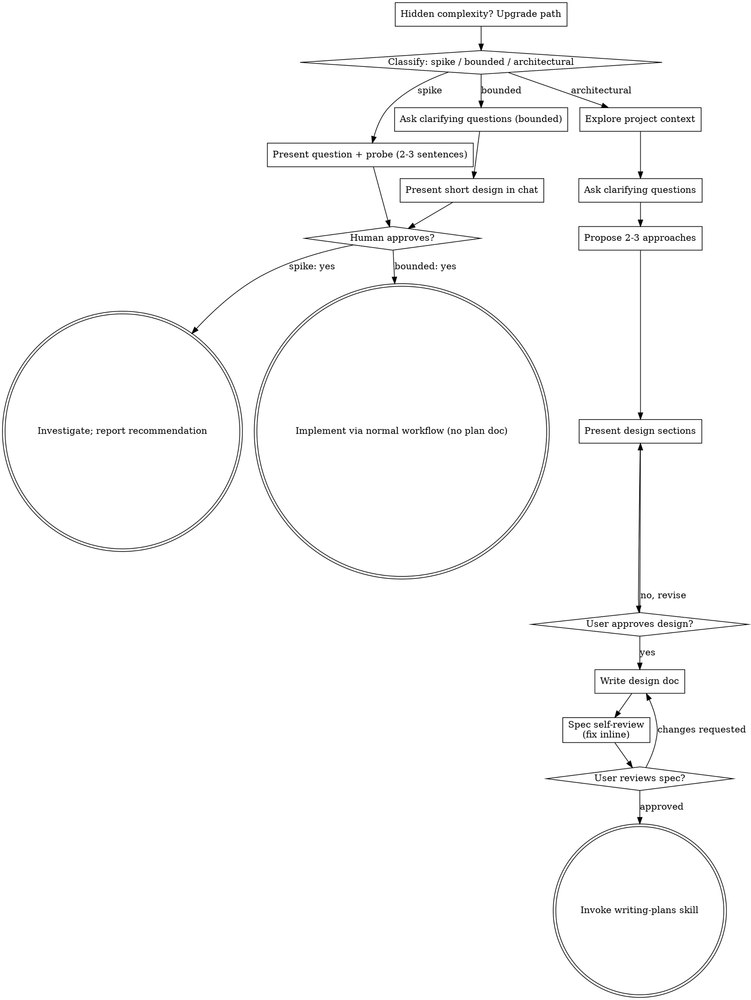

# 2026-09-16 — M6 范围讨论

> 会话 ID `5d7a2ff5`｜队员消息 3 条 / AI 回复 4 条
> **AI 回复已截断至 600 字符**，完整原文见 `原始记录/5d7a2ff5*.jsonl`。
> 时间戳为 UTC（本地为 +8 小时）。

---

**[2026-09-16 10:49] 队员：**

看看1M6是什么

**[2026-09-16 10:49] AI：**

我把仓库搜了一遍:**"1M6" 这个字符串在 8GodOS 里 0 命中**(源码、文档、Makefile、git 历史都没有)。 最接近的是 **M6 里程碑**,我按这个理解答复: **M6 目前还没有定义。** `计划书.md` 里只有一行状态: - `计划书.md:158` —— "当前进度:M0~M5 已完成 ✅;**M6 待开始**。" 但下面**没有 M6 小节**。M0–M5 每个都有独立的「做什么 / 验证标准 / 状态」,M6 只有这一句占位。 仓库里关于"第 6 步"的全部线索只有两条,指向同一件事: - `src/vga.c:106-109` —— `vga_printf()` 是空壳,注释写着 `TODO —— 第 6 步再实现` - `计划书.md:190` —— M5 的「不做」条目:"`vga_printf` 推迟到第 6 步(接口已留在 `vga.h`)" 也就是说:**M5 收尾时把 `vga_printf` 明确押后给了 M6,接口已在 `vga.h:33` 声明好,实现留在 `vga.c` 里当壳。**除此之外 M6 要做什么、验证标准是什么,文档里一个字都没有。 另外 `计划书.md:264` 末尾还有一个"后续里程碑(不在第一版,仅登记方向)"的清单(高半区内核 / GDT+IDT+键盘 / 内存管理+kmalloc / 定时器+多任务 …（完整内容见原始记录）

**[2026-09-16 12:53] 队员：**

下一个阶段是处理CPU异常,看看具体的方案实现

**[2026-09-16 12:53] 队员：**

Base directory for this skill: C:\Users\a'a'a\.claude\plugins\cache\claude-plugins-official\superpowers\6.3.0\skills\brainstorming

# Brainstorming Ideas Into Designs

Help turn ideas into fully formed designs and specs through natural collaborative dialogue.

Start by classifying how much process the request needs, then work
through your path: understand the context, refine the idea, present a
design, and get your human partner's approval.

<HARD-GATE>
Do NOT invoke any implementation skill, write any code, scaffold any
project, or take any implementation action until you have told your
human partner what you intend and they have approved it. This applies
to EVERY task on EVERY path below — the ceremony scales with the task;
the approval gate never does.
</HARD-GATE>

## Three Paths

Before your first question, classify the request and say the
classification out loud — "this looks bounded, so I'll present a short
design here rather than write a spec" — so your human partner can
override it:

- **Spike** — a feasibility question ("can we...", "is it possible...",
  "quick and dirty is fine") whose output is an answer, not code you
  keep. Present the question and what you'll try in 2-3 sentences, get
  a nod, then find out as cheaply as correctness allows. No design
  doc, no spec file. Report findings as a recommendation; anything you
  built stays labeled throwaway.
- **Bounded** — a well-scoped change to code that already exists in
  this repo: a new flag, a small endpoint, a one-file fix.
  Understanding the kind of app is not enough — bounded means the flow
  you are changing is already here to read. If there is no existing
  flow to change, the task is not bounded. Ask the clarifying
  questions that matter, present a short design IN CHAT (a few
  sentences to a few short paragraphs), and STOP. Implementation
  starts only after your human partner says yes to that design — a
  bounded task's approval is as hard a gate as an architectural
  one. No spec file, no implementation plan document.
- **Architectural** — new projects, new subsystems, changes that
  restructure how components fit together or alter interfaces others
  depend on. Follow the full process: questions, approaches, sectioned
  design, written spec, then the writing-plans skill.

When in doubt between two paths, take the heavier one. The ratchet is
one-way: hidden complexity discovered mid-task upgrades the path —
stop, say so, and step up. Nothing downgrades mid-task.

## Anti-Pattern: "Too Simple To Need Approval"

Every path ends with your human partner approving your intent before
implementation. A todo list, a single-function utility, a config
change — the design may be two sentences in chat, but you MUST present
it and get approval. "Simple" tasks are where unexamined assumptions
cause the most wasted work. What scales with simplicity is the
artifact, never the approval.

## Red Flags

| Thought | Reality |
|---------|---------|
| "This is too simple to need a design" | Simple means a short design, not no design. Two sentences in chat, then approval. |
| "I'll call it bounded and skip the spec" | Reaching for a label to skip work IS the doubt — take the heavier path. |
| "It's bounded and the design is obvious — I'll start while they read it" | The gate is the approval, not the design's length. Present, then stop until you hear yes. |
| "I understand this kind of app, so it's bounded" | Bounded measures the repo, not your familiarity. A new project has no existing flow — it is architectural. |
| "The spike works, so I'll keep the code" | A spike's output is an answer. Keeping the code is a new request — classify it. |
| "It grew, but I'm almost done — no need to re-classify" | Hidden complexity upgrades the path mid-task. Stop and say so. |
| "They approved the spike, so the follow-up change is approved too" | Each task gets its own classification and its own approval. |

## Checklist

Classify first, announce the path, then create a task for each item on
your path and complete them in order.

**Spike:**
1. **Explore project context** — enough to frame the probe
2. **Present question + probe plan** — 2-3 sentences
3. **Get approval** — a nod is enough
4. **Investigate** — as cheaply as correctness allows
5. **Report findings** — a recommendation; label anything built as throwaway

**Bounded:**
1. **Explore project context** — check files, docs, recent commits
2. **Ask clarifying questions** — one at a time, the ones that matter
3. **Present short design in chat** — approach, files touched, testing
4. **Get approval** — STOP and wait for an explicit yes; presenting the design and starting in the same breath is skipping the gate
5. **Implement** — proceed with the normal development workflow (TDD applies); no plan document

**Architectural:**
1. **Explore project context** — check files, docs, recent commits
2. **Offer the visual companion just-in-time** — NOT upfront. The first time a question would genuinely be clearer shown than described, offer it then (its own message); on approval its browser tab opens for you. If no visual question ever arises, never offer it. See the Visual Companion section below.
3. **Ask clarifying questions** — one at a time, understand purpose/constraints/success criteria
4. **Propose 2-3 approaches** — with trade-offs and your recommendation
5. **Present design** — in sections scaled to their complexity, get user approval after each section
6. **Write design doc** — save to `docs/superpowers/specs/YYYY-MM-DD-<topic>-design.md` and commit
7. **Spec self-review** — quick inline check for placeholders, contradictions, ambiguity, scope (see below)
8. **User reviews written spec** — ask user to review the spec file before proceeding
9. **Transition to implementation** — invoke writing-plans skill to create implementation plan

## Process Flow

**Terminal states are path-bound.** Architectural: the ONLY skill you
invoke after brainstorming is writing-plans — never frontend-design,
mcp-builder, or any other implementation skill. Bounded: after
approval, implementation proceeds directly through the normal
development workflow; no plan document. Spike: the terminal state is a
reported recommendation.

## The Process

The subsections below serve the bounded and architectural paths (a
spike stops at "present the probe, get a nod"). Sections from
**Exploring approaches** onward are architectural-path depth — for
bounded work, context plus a few questions plus a short in-chat design
is the whole process.

**Understanding the idea:**

- Check out the current project state first (files, docs, recent commits)
- Before asking detailed questions, assess scope: if the request describes multiple independent subsystems (e.g., "build a platform with chat, file storage, billing, and analytics"), flag this immediately. Don't spend questions refining details of a project that needs to be decomposed first.
- If the project is too large for a single spec, help the user decompose into sub-projects: what are the independent pieces, how do they relate, what order should they be built? Then brainstorm the first sub-project through the normal design flow. Each sub-project gets its own spec → plan → implementation cycle.
- For appropriately-scoped projects, ask questions one at a time to refine the idea
- Prefer multiple choice questions when possible, but open-ended is fine too
- Only one question per message - if a topic needs more exploration, break it into multiple questions
- Focus on understanding: purpose, constraints, success criteria

**Exploring approaches:**

- Propose 2-3 different approaches with trade-offs
- Present options conversationally with your recommendation and reasoning
- Lead with your recommended option and explain why
- YAGNI ruthlessly - remove unnecessary features from every approach and design

**Presenting the design:**

- Once you believe you understand what you're building, present the design
- Scale each section to its complexity: a few sentences if straightforward, up to 200-300 words if nuanced
- Ask after each section whether it looks right so far
- Cover: architecture, components, data flow, error handling, testing
- Be ready to go back and clarify if something doesn't make sense

**Design for isolation and clarity:**

- Break the system into smaller units that each have one clear purpose, communicate through well-defined interfaces, and can be understood and tested independently
- For each unit, you should be able to answer: what does it do, how do you use it, and what does it depend on?
- Can someone understand what a unit does without reading its internals? Can you change the internals without breaking consumers? If not, the boundaries need work.
- Smaller, well-bounded units are also easier for you to work with - you reason better about code you can hold in context at once, and your edits are more reliable when files are focused. When a file grows large, that's often a signal that it's doing too much.

**Working in existing codebases:**

- Explore the current structure before proposing changes. Follow existing patterns.
- Where existing code has problems that affect the work (e.g., a file that's grown too large, unclear boundaries, tangled responsibilities), include targeted improvements as part of the design - the way a good developer improves code they're working in.
- Don't propose unrelated refactoring. Stay focused on what serves the current goal.

## After the Design (architectural path)

**Documentation:**

- Write the validated design (spec) to `docs/superpowers/specs/YYYY-MM-DD-<topic>-design.md`
  - (User preferences for spec location override this default)
- Use elements-of-style:writing-clearly-and-concisely skill if available
- Commit the design document to git

**Spec Self-Review:**
After writing the spec document, look at it with fresh eyes:

1. **Placeholder scan:** Any "TBD", "TODO", incomplete sections, or vague requirements? Fix them.
2. **Internal consistency:** Do any sections contradict each other? Does the architecture match the feature descriptions?
3. **Scope check:** Is this focused enough for a single implementation plan, or does it need decomposition?
4. **Ambiguity check:** Could any requirement be interpreted two different ways? If so, pick one and make it explicit.

Fix any issues inline. No need to re-review — just fix and move on.

**User Review Gate:**
After the spec review loop passes, ask the user to review the written spec before proceeding:

> "Spec written and committed to `<path>`. Please review it and let me know if you want to make any changes before we start writing out the implementation plan."

Wait for the user's response. If they request changes, make them and re-run the spec review loop. Only proceed once the user approves.

**Implementation:**

- Invoke the writing-plans skill to create a detailed implementation plan
- Do NOT invoke any other skill. writing-plans is the next step.

## Visual Companion

A browser-based companion for showing mockups, diagrams, and visual options during brainstorming. Available as a tool — not a mode. Accepting the companion means it's available for questions that benefit from visual treatment; it does NOT mean every question goes through the browser.

**Offering the companion (just-in-time):** Do NOT offer it upfront. Wait until a question would genuinely be clearer shown than told — a real mockup / layout / diagram question, not merely a UI *topic*. The first time that happens, offer it then, as its own message:
> "This next part might be easier if I show you — I can put together mockups, diagrams, and comparisons in a browser tab as we go. It's still new and can be token-intensive. Want me to? I'll open it for you."

**This offer MUST be its own message.** Only the offer — no clarifying question, summary, or other content. Wait for the user's response. If they accept, start the server with `--open` so their browser opens to the first screen automatically. If they decline, continue text-only and don't offer again unless they raise it.

**Per-question decision:** Even after the user accepts, decide FOR EACH QUESTION whether to use the browser or the terminal. The test: **would the user understand this better by seeing it than reading it?**

- **Use the browser** for content that IS visual — mockups, wireframes, layout comparisons, architecture diagrams, side-by-side visual designs
- **Use the terminal** for content that is text — requirements questions, conceptual choices, tradeoff lists, A/B/C/D text options, scope decisions

A question about a UI topic is not automatically a visual question. "What does personality mean in this context?" is a conceptual question — use the terminal. "Which wizard layout works better?" is a visual question — use the browser.

If they agree to the companion, read the detailed guide before proceeding:
`skills/brainstorming/visual-companion.md`

ARGUMENTS: 设计 8GodOS 的 CPU 异常处理方案 (IDT + 异常入口 + 崩溃转储)

**[2026-09-16 12:54] AI：**

我先说路径分类:**这是 architectural(新子系统)** —— 异常处理在这个仓库里没有现成的流程可以改,它要新增 IDT/ISR 入口、动 GDT(boot.asm)、加 `isr.asm`/`idt.c`、改 Makefile 和链接脚本,还会给后面所有模块依赖的"出错就停机"接口定形状。所以走完整流程:先问清楚 → 给方案对比 → 分节设计 → 写 spec → 你再动手实现(代码你写,我只做设计和审阅)。 我先把仓库现状摸了一遍,几个和异常直接相关的既成事实: - `boot.asm:97-103` 已经有一个 **3 项的 64 位 GDT**(null / code `0x08` / data `0x10`),放在 `.rodata` 里,`lgdt` 之前没有任何 IDT 准备。**没有 TSS。** - `linker.ld` 只把内核压在前 2MB(`. = 0x100000`),页表 `pd[0]` 恒等映射前 2MB(`boot.asm:55`)—— 异常栈/IST 只能在 2MB 内。 - 整个内核跑在**一个 16KB 栈**上(`boot.asm:112`),`kmain` 是 `for(;;) hlt`。 - `vga.c:106` 的 `vga_printf` 还是空壳,注释写着"第 6 步再实现" —— 而一个像样的转储**必须有格式化 …（完整内容见原始记录）

**[2026-09-16 13:55] AI：**

收到,范围按你的表述定:**最小异常闭环**,不动 TSS/IST、不动 PIC/IRQ。你的六条我认了,顺序也对(IDT 结构 → `lidt` → asm stub → C 处理函数 → 几个常见异常)。 在往下走之前,先点两个和你描述有出入的地方,因为它们会影响设计: **一、"执行非法指令 → triple fault" 的链条比你写的多一环。** 没有 IDT 时,#DE 或 #UD 会先触发 → 因为找不到处理程序,CPU 立刻升级成 **#GP** → #GP 还是没处理程序 → 升级成 **#DF** → #DF 也没处理程序 → **三重故障**,QEMU 复位(加了 `-no-reboot` 就是直接退出)。你看到的黑屏/重启其实是最后一步。这意味着 M6 之后,这三条链子上的每一环都应该有自己的打印,否则你只是把"静默重启"换成了"更早的静默重启"。 **二、你选了不做 TSS/IST —— 那 #DF 依然救不回来。** 这是有意为之的取舍,不是漏洞:如果异常处理函数**自己**又出了错(最典型的是栈溢出:压栈压到没映射的页上 → #PF → 而 #PF 处理函数又要压栈 → 还是那个坏栈 → #DF),没有独立栈的话 #DF 还是会三重故障。**M6 能覆盖的是"第一次异常"**,这一条记在文档的"不做"里就行,别指望它。 现在最需要你定的一个问题 ——  …（完整内容见原始记录）

**[2026-09-16 16:05] AI：**

方向定了,我来给**方案对比**。先回答一个隐含问题:stub 到底写几个。 ## 三个方案 **方案一(我推荐):NASM 宏生成全部 32 个 stub + 统一 common stub + C 侧表驱动** 用 NASM 的 `%macro` 把两类 stub 各写一次,然后逐行列出 32 个向量。asm 侧大约 40 行。所有 stub 都跳到同一个 `isr_common`(压通用寄存器 → 调 C),C 侧是一张 `{向量号, 名字, 有无错误码}` 的常量表和**一个** `switch`。 关键理由:**宏让"只做 4 个"省不下多少东西**,却会让你在 #GP 之外的异常上继续看到静默重启 —— 那正是你这次要消灭的现象。写 32 个和写 4 个的 asm 工作量差 30 行,换来的是"任何异常都不再是黑屏",这笔账很划算。 **方案二:只为 #DE / #UD / #PF / #GP 写 4 个 stub,其余 28 项指向一个"未处理"入口** 最贴你原话的"至少处理几个"。代码最短。但一条打错的指令触发 #AC、栈出问题触发 #SS 时,你还是黑屏 —— 而 #SS 恰恰是栈出事的信号,是调试时最想知道的那一个。 **方案三:不写汇编,用 GCC 的 `__attribute__((interrupt))`** 在 freestanding + 你们现有的  …（完整内容见原始记录）
