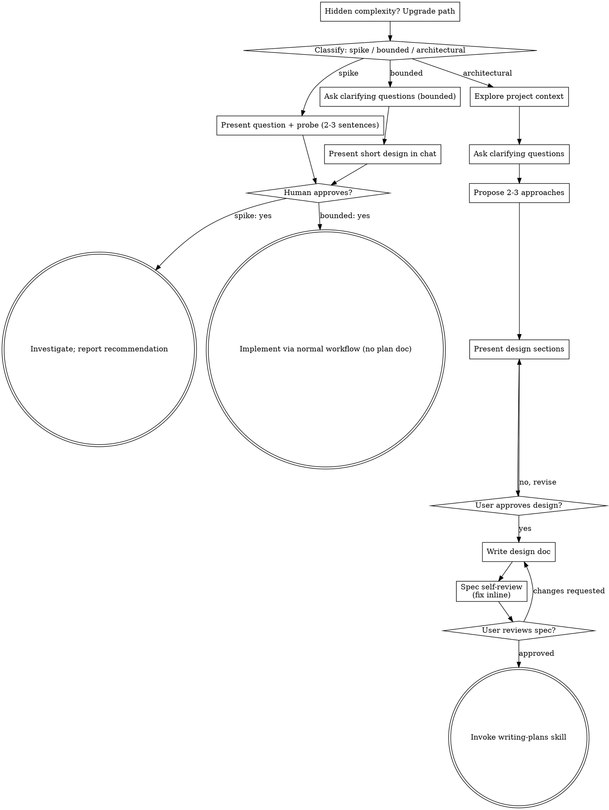

# 2026-09-17 — M6 规格与实施计划

> 会话 ID `31fbfa58`｜队员消息 10 条 / AI 回复 20 条
> **AI 回复已截断至 600 字符**，完整原文见 `原始记录/31fbfa58*.jsonl`。
> 时间戳为 UTC（本地为 +8 小时）。

---

**[2026-09-17 08:09] 队员：**

看看这个终端为什么有个正方形一闪一闪的

**[2026-09-17 08:09] 队员：**

Base directory for this skill: C:\Users\a'a'a\.claude\plugins\cache\claude-plugins-official\superpowers\6.3.0\skills\systematic-debugging

# Systematic Debugging

## Overview

**Core principle:** ALWAYS find root cause before attempting fixes. Symptom fixes are failure.

**Violating the letter of this process is violating the spirit of debugging.**

## The Iron Law

```
NO FIXES WITHOUT ROOT CAUSE INVESTIGATION FIRST
```

If you haven't completed Phase 1, you cannot propose fixes.

## When to Use

Use for ANY technical issue:
- Test failures
- Bugs in production
- Unexpected behavior
- Performance problems
- Build failures
- Integration issues

**Use this ESPECIALLY when:**
- Under time pressure (emergencies make guessing tempting)
- "Just one quick fix" seems obvious
- You've already tried multiple fixes
- Previous fix didn't work
- You don't fully understand the issue

**Don't skip when:**
- Issue seems simple (simple bugs have root causes too)
- You're in a hurry (rushing guarantees rework)
- Manager wants it fixed NOW (systematic is faster than thrashing)

## The Four Phases

You MUST complete each phase before proceeding to the next.

### Phase 1: Root Cause Investigation

**BEFORE attempting ANY fix:**

1. **Read Error Messages Carefully**
   - Don't skip past errors or warnings
   - They often contain the exact solution
   - Read stack traces completely
   - Note line numbers, file paths, error codes

2. **Reproduce Consistently**
   - Can you trigger it reliably?
   - What are the exact steps?
   - Does it happen every time?
   - If not reproducible → gather more data, don't guess

3. **Check Recent Changes**
   - What changed that could cause this?
   - Git diff, recent commits
   - New dependencies, config changes
   - Environmental differences

4. **Gather Evidence in Multi-Component Systems**

   **WHEN system has multiple components (CI → build → signing, API → service → database):**

   **BEFORE proposing fixes, add diagnostic instrumentation:**
   ```
   For EACH component boundary:
     - Log what data enters component
     - Log what data exits component
     - Verify environment/config propagation
     - Check state at each layer

   Run once to gather evidence showing WHERE it breaks
   THEN analyze evidence to identify failing component
   THEN investigate that specific component
   ```

   **Example (multi-layer system):**
   ```bash
   # Layer 1: Workflow
   echo "=== Secrets available in workflow: ==="
   echo "IDENTITY: ${IDENTITY:+SET}${IDENTITY:-UNSET}"

   # Layer 2: Build script
   echo "=== Env vars in build script: ==="
   env | grep IDENTITY || echo "IDENTITY not in environment"

   # Layer 3: Signing script
   echo "=== Keychain state: ==="
   security list-keychains
   security find-identity -v

   # Layer 4: Actual signing
   codesign --sign "$IDENTITY" --verbose=4 "$APP"
   ```

   **This reveals:** Which layer fails (secrets → workflow ✓, workflow → build ✗)

5. **Trace Data Flow**

   **WHEN error is deep in call stack:**

   See `root-cause-tracing.md` in this directory for the complete backward tracing technique.

   **Quick version:**
   - Where does bad value originate?
   - What called this with bad value?
   - Keep tracing up until you find the source
   - Fix at source, not at symptom

### Phase 2: Pattern Analysis

**Find the pattern before fixing:**

1. **Find Working Examples**
   - Locate similar working code in same codebase
   - What works that's similar to what's broken?

2. **Compare Against References**
   - If implementing pattern, read reference implementation COMPLETELY
   - Don't skim - read every line
   - Understand the pattern fully before applying

3. **Identify Differences**
   - What's different between working and broken?
   - List every difference, however small
   - Don't assume "that can't matter"

4. **Understand Dependencies**
   - What other components does this need?
   - What settings, config, environment?
   - What assumptions does it make?

### Phase 3: Hypothesis and Testing

**Scientific method:**

1. **Form Single Hypothesis**
   - State clearly: "I think X is the root cause because Y"
   - Write it down
   - Be specific, not vague

2. **Test Minimally**
   - Make the SMALLEST possible change to test hypothesis
   - One variable at a time
   - Don't fix multiple things at once

3. **Verify Before Continuing**
   - Did it work? Yes → Phase 4
   - Didn't work? Form NEW hypothesis
   - DON'T add more fixes on top

4. **When You Don't Know**
   - Say "I don't understand X"
   - Don't pretend to know
   - Ask for help
   - Research more

### Phase 4: Implementation

**Fix the root cause, not the symptom:**

1. **Create Failing Test Case**
   - Simplest possible reproduction
   - Automated test if possible
   - One-off test script if no framework
   - MUST have before fixing
   - Use the `superpowers:test-driven-development` skill for writing proper failing tests

2. **Implement Single Fix**
   - Address the root cause identified
   - ONE change at a time
   - No "while I'm here" improvements
   - No bundled refactoring

3. **Verify Fix**
   - Test passes now?
   - No other tests broken?
   - Issue actually resolved?
   - Use the `superpowers:verification-before-completion` skill before claiming success

4. **If Fix Doesn't Work**
   - STOP
   - Count: How many fixes have you tried?
   - If < 3: Return to Phase 1, re-analyze with new information
   - **If ≥ 3: STOP and question the architecture (step 5 below)**
   - DON'T attempt Fix #4 without architectural discussion

5. **If 3+ Fixes Failed: Question Architecture**

   **Pattern indicating architectural problem:**
   - Each fix reveals new shared state/coupling/problem in different place
   - Fixes require "massive refactoring" to implement
   - Each fix creates new symptoms elsewhere

   **STOP and question fundamentals:**
   - Is this pattern fundamentally sound?
   - Are we "sticking with it through sheer inertia"?
   - Should we refactor architecture vs. continue fixing symptoms?

   **Discuss with your human partner before attempting more fixes**

   This is NOT a failed hypothesis - this is a wrong architecture.

## Red Flags - STOP and Follow Process

If you catch yourself thinking:
- "Quick fix for now, investigate later"
- "Just try changing X and see if it works"
- "Add multiple changes, run tests"
- "Skip the test, I'll manually verify"
- "It's probably X, let me fix that"
- "I don't fully understand but this might work"
- "Pattern says X but I'll adapt it differently"
- "Here are the main problems: [lists fixes without investigation]"
- Proposing solutions before tracing data flow
- **"One more fix attempt" (when already tried 2+)**
- **Each fix reveals new problem in different place**

**ALL of these mean: STOP. Return to Phase 1.**

**If 3+ fixes failed:** Question the architecture (see Phase 4.5)

## your human partner's Signals You're Doing It Wrong

**Watch for these redirections:**
- "Is that not happening?" - You assumed without verifying
- "Will it show us...?" - You should have added evidence gathering
- "Stop guessing" - You're proposing fixes without understanding
- "Ultra-think this" - Question fundamentals, not just symptoms
- "We're stuck?" (frustrated) - Your approach isn't working

**When you see these:** STOP. Return to Phase 1.

## Common Rationalizations

| Excuse | Reality |
|--------|---------|
| "Issue is simple, don't need process" | Simple issues have root causes too. Process is fast for simple bugs. |
| "Emergency, no time for process" | Systematic debugging is FASTER than guess-and-check thrashing. |
| "Just try this first, then investigate" | First fix sets the pattern. Do it right from the start. |
| "I'll write test after confirming fix works" | Untested fixes don't stick. Test first proves it. |
| "Multiple fixes at once saves time" | Can't isolate what worked. Causes new bugs. |
| "Reference too long, I'll adapt the pattern" | Partial understanding guarantees bugs. Read it completely. |
| "I see the problem, let me fix it" | Seeing symptoms ≠ understanding root cause. |
| "One more fix attempt" (after 2+ failures) | 3+ failures = architectural problem. Question pattern, don't fix again. |

## Quick Reference

| Phase | Key Activities | Success Criteria |
|-------|---------------|------------------|
| **1. Root Cause** | Read errors, reproduce, check changes, gather evidence | Understand WHAT and WHY |
| **2. Pattern** | Find working examples, compare | Identify differences |
| **3. Hypothesis** | Form theory, test minimally | Confirmed or new hypothesis |
| **4. Implementation** | Create test, fix, verify | Bug resolved, tests pass |

## When Process Reveals "No Root Cause"

If systematic investigation reveals issue is truly environmental, timing-dependent, or external:

1. You've completed the process
2. Document what you investigated
3. Implement appropriate handling (retry, timeout, error message)
4. Add monitoring/logging for future investigation

**But:** 95% of "no root cause" cases are incomplete investigation.

## Supporting Techniques

These techniques are part of systematic debugging and available in this directory:

- **`root-cause-tracing.md`** - Trace bugs backward through call stack to find original trigger
- **`defense-in-depth.md`** - Add validation at multiple layers after finding root cause
- **`condition-based-waiting.md`** - Replace arbitrary timeouts with condition polling


ARGUMENTS: VGA 终端上出现一个一闪一闪的正方形

**[2026-09-17 08:09] AI：**

Using superpowers:systematic-debugging. Phase 1 — 先收集证据，不猜。

**[2026-09-17 08:09] AI：**

用户已经有一套很完整的取证流程。先看已有的证据：

**[2026-09-17 08:11] AI：**

证据很干净——用户自己的 screendump 里**根本不存在正方形**。先把剩下的证据补齐：

**[2026-09-17 08:12] AI：**

现在做决定性实验：`run_check.sh` 是在 `-display none` 下截的图。**带图形前端**时 QEMU 渲染文本光标的路径不同——这正是"截图是细下划线、屏幕却是方块"的可能来源。WSL 里有 QEMU：

**[2026-09-17 08:12] AI：**

`gtk` 可用。跑对照实验——**同一份 ISO，分别用 `-display none`（你截图用的）和真正的图形前端 `gtk` 各截三帧**，直接比对光标格子里的像素：

**[2026-09-17 08:13] AI：**

WSL 重启把 `/tmp` 清了。改成一次会话里跑完采集+分析：

**[2026-09-17 08:14] AI：**

证据查完了，结论和你的描述对不上——先说结论。 ## 那个闪烁的东西 = 硬件光标；但在 QEMU 里它是**细下划线**，不是正方形 我用的都是你自己的取证工具，没有新增假设： **1. 显存里没有方块。** `decode_vga.py build/vga.bin`：25 行只有前 3 行有文本，属性字节非 `0x07` 的格子 **0 个**。字节层面干干净净。 **2. 整屏像素扫一遍，唯一的"异类"就是光标。** 对 three shots 做非黑像素连通块分析： | | 连通块数 | 差异 | |---|---|---| | shot1 | 45 | | | shot2 | 44 | 少的那一块就是光标 | | shot3 | 45 | | 差集落在**第 3 行第 0 列**，形状是 `9 宽 × 2 高`——扫描线 14~15，正是 `vga_enable_cursor()` 想要的下划线。字形连通块全在第 0~2 行，别处什么都没有。 **3. 换图形前端重跑，结果一样。** 我怀疑过"截图走的是 `-display none`，你看的是 GTK 窗口，两条渲染路径不同"，于是在 WSL 里同一份 ISO 各跑三帧： ``` display = none y14/y15 #########....... (9→0→9) display = gtk y14/y15  …（完整内容见原始记录）

**[2026-09-17 08:15] 队员：**

[Request interrupted by user]

**[2026-09-17 08:16] 队员：**

硬件光标是什么

**[2026-09-17 08:16] AI：**

## 硬件光标 = 由显示控制器**叠加渲染**出来的那个闪烁标记，它不在显存里 你在 `vga.c:37-45` 的注释其实已经写对了大半，我把它补全。 ### 一句话定义 VGA 有两条完全独立的"在屏幕上显出东西"的通路： | | 显存通路 | 光标通路 | |---|---|---| | 数据放哪 | `0xB8000`，每格 2 字节（字符+属性） | **CRTC 内部的寄存器**，25 个，CPU 只能经 `0x3D4`/`0x3D5` 这对索引/数据口间接访问 | | 谁去画 | 你写什么就显示什么 | 扫描输出时，控制器**额外**把那一格盖一层 | | CPU 能读回来吗 | 能（你 `memsave` 就是读它） | 只能读寄存器，屏幕上的像素读不回来 | | 会闪吗 | 不会 | **会**，闪烁是它自带的 | 所以它是"硬件"的：**是个纯粹由显示控制器在扫描时叠加的效果**，绕开了 CPU，也绕开了显存。（在 QEMU 里当然是一段 C 代码在模拟，但语义上等价——真机上由 CRTC 芯片做，行为一致。） ### 字符格的几何 720×400 文本模式每格 9×16 像素，扫描线 0~15： ``` 扫描线 0 ┌─────────┐ │ │ │ 字形区 │ 13 │ │ 14 ├─────────┤ ← 0x0A 低 5 位 = 起始扫描线 = 0x0 …（完整内容见原始记录）

**[2026-09-17 08:23] 队员：**

那M6怎么写?

**[2026-09-17 08:23] 队员：**

Base directory for this skill: C:\Users\a'a'a\.claude\plugins\cache\claude-plugins-official\superpowers\6.3.0\skills\brainstorming

# Brainstorming Ideas Into Designs

Help turn ideas into fully formed designs and specs through natural collaborative dialogue.

Start by classifying how much process the request needs, then work
through your path: understand the context, refine the idea, present a
design, and get your human partner's approval.

<HARD-GATE>
Do NOT invoke any implementation skill, write any code, scaffold any
project, or take any implementation action until you have told your
human partner what you intend and they have approved it. This applies
to EVERY task on EVERY path below — the ceremony scales with the task;
the approval gate never does.
</HARD-GATE>

## Three Paths

Before your first question, classify the request and say the
classification out loud — "this looks bounded, so I'll present a short
design here rather than write a spec" — so your human partner can
override it:

- **Spike** — a feasibility question ("can we...", "is it possible...",
  "quick and dirty is fine") whose output is an answer, not code you
  keep. Present the question and what you'll try in 2-3 sentences, get
  a nod, then find out as cheaply as correctness allows. No design
  doc, no spec file. Report findings as a recommendation; anything you
  built stays labeled throwaway.
- **Bounded** — a well-scoped change to code that already exists in
  this repo: a new flag, a small endpoint, a one-file fix.
  Understanding the kind of app is not enough — bounded means the flow
  you are changing is already here to read. If there is no existing
  flow to change, the task is not bounded. Ask the clarifying
  questions that matter, present a short design IN CHAT (a few
  sentences to a few short paragraphs), and STOP. Implementation
  starts only after your human partner says yes to that design — a
  bounded task's approval is as hard a gate as an architectural
  one. No spec file, no implementation plan document.
- **Architectural** — new projects, new subsystems, changes that
  restructure how components fit together or alter interfaces others
  depend on. Follow the full process: questions, approaches, sectioned
  design, written spec, then the writing-plans skill.

When in doubt between two paths, take the heavier one. The ratchet is
one-way: hidden complexity discovered mid-task upgrades the path —
stop, say so, and step up. Nothing downgrades mid-task.

## Anti-Pattern: "Too Simple To Need Approval"

Every path ends with your human partner approving your intent before
implementation. A todo list, a single-function utility, a config
change — the design may be two sentences in chat, but you MUST present
it and get approval. "Simple" tasks are where unexamined assumptions
cause the most wasted work. What scales with simplicity is the
artifact, never the approval.

## Red Flags

| Thought | Reality |
|---------|---------|
| "This is too simple to need a design" | Simple means a short design, not no design. Two sentences in chat, then approval. |
| "I'll call it bounded and skip the spec" | Reaching for a label to skip work IS the doubt — take the heavier path. |
| "It's bounded and the design is obvious — I'll start while they read it" | The gate is the approval, not the design's length. Present, then stop until you hear yes. |
| "I understand this kind of app, so it's bounded" | Bounded measures the repo, not your familiarity. A new project has no existing flow — it is architectural. |
| "The spike works, so I'll keep the code" | A spike's output is an answer. Keeping the code is a new request — classify it. |
| "It grew, but I'm almost done — no need to re-classify" | Hidden complexity upgrades the path mid-task. Stop and say so. |
| "They approved the spike, so the follow-up change is approved too" | Each task gets its own classification and its own approval. |

## Checklist

Classify first, announce the path, then create a task for each item on
your path and complete them in order.

**Spike:**
1. **Explore project context** — enough to frame the probe
2. **Present question + probe plan** — 2-3 sentences
3. **Get approval** — a nod is enough
4. **Investigate** — as cheaply as correctness allows
5. **Report findings** — a recommendation; label anything built as throwaway

**Bounded:**
1. **Explore project context** — check files, docs, recent commits
2. **Ask clarifying questions** — one at a time, the ones that matter
3. **Present short design in chat** — approach, files touched, testing
4. **Get approval** — STOP and wait for an explicit yes; presenting the design and starting in the same breath is skipping the gate
5. **Implement** — proceed with the normal development workflow (TDD applies); no plan document

**Architectural:**
1. **Explore project context** — check files, docs, recent commits
2. **Offer the visual companion just-in-time** — NOT upfront. The first time a question would genuinely be clearer shown than described, offer it then (its own message); on approval its browser tab opens for you. If no visual question ever arises, never offer it. See the Visual Companion section below.
3. **Ask clarifying questions** — one at a time, understand purpose/constraints/success criteria
4. **Propose 2-3 approaches** — with trade-offs and your recommendation
5. **Present design** — in sections scaled to their complexity, get user approval after each section
6. **Write design doc** — save to `docs/superpowers/specs/YYYY-MM-DD-<topic>-design.md` and commit
7. **Spec self-review** — quick inline check for placeholders, contradictions, ambiguity, scope (see below)
8. **User reviews written spec** — ask user to review the spec file before proceeding
9. **Transition to implementation** — invoke writing-plans skill to create implementation plan

## Process Flow



**Terminal states are path-bound.** Architectural: the ONLY skill you
invoke after brainstorming is writing-plans — never frontend-design,
mcp-builder, or any other implementation skill. Bounded: after
approval, implementation proceeds directly through the normal
development workflow; no plan document. Spike: the terminal state is a
reported recommendation.

## The Process

The subsections below serve the bounded and architectural paths (a
spike stops at "present the probe, get a nod"). Sections from
**Exploring approaches** onward are architectural-path depth — for
bounded work, context plus a few questions plus a short in-chat design
is the whole process.

**Understanding the idea:**

- Check out the current project state first (files, docs, recent commits)
- Before asking detailed questions, assess scope: if the request describes multiple independent subsystems (e.g., "build a platform with chat, file storage, billing, and analytics"), flag this immediately. Don't spend questions refining details of a project that needs to be decomposed first.
- If the project is too large for a single spec, help the user decompose into sub-projects: what are the independent pieces, how do they relate, what order should they be built? Then brainstorm the first sub-project through the normal design flow. Each sub-project gets its own spec → plan → implementation cycle.
- For appropriately-scoped projects, ask questions one at a time to refine the idea
- Prefer multiple choice questions when possible, but open-ended is fine too
- Only one question per message - if a topic needs more exploration, break it into multiple questions
- Focus on understanding: purpose, constraints, success criteria

**Exploring approaches:**

- Propose 2-3 different approaches with trade-offs
- Present options conversationally with your recommendation and reasoning
- Lead with your recommended option and explain why
- YAGNI ruthlessly - remove unnecessary features from every approach and design

**Presenting the design:**

- Once you believe you understand what you're building, present the design
- Scale each section to its complexity: a few sentences if straightforward, up to 200-300 words if nuanced
- Ask after each section whether it looks right so far
- Cover: architecture, components, data flow, error handling, testing
- Be ready to go back and clarify if something doesn't make sense

**Design for isolation and clarity:**

- Break the system into smaller units that each have one clear purpose, communicate through well-defined interfaces, and can be understood and tested independently
- For each unit, you should be able to answer: what does it do, how do you use it, and what does it depend on?
- Can someone understand what a unit does without reading its internals? Can you change the internals without breaking consumers? If not, the boundaries need work.
- Smaller, well-bounded units are also easier for you to work with - you reason better about code you can hold in context at once, and your edits are more reliable when files are focused. When a file grows large, that's often a signal that it's doing too much.

**Working in existing codebases:**

- Explore the current structure before proposing changes. Follow existing patterns.
- Where existing code has problems that affect the work (e.g., a file that's grown too large, unclear boundaries, tangled responsibilities), include targeted improvements as part of the design - the way a good developer improves code they're working in.
- Don't propose unrelated refactoring. Stay focused on what serves the current goal.

## After the Design (architectural path)

**Documentation:**

- Write the validated design (spec) to `docs/superpowers/specs/YYYY-MM-DD-<topic>-design.md`
  - (User preferences for spec location override this default)
- Use elements-of-style:writing-clearly-and-concisely skill if available
- Commit the design document to git

**Spec Self-Review:**
After writing the spec document, look at it with fresh eyes:

1. **Placeholder scan:** Any "TBD", "TODO", incomplete sections, or vague requirements? Fix them.
2. **Internal consistency:** Do any sections contradict each other? Does the architecture match the feature descriptions?
3. **Scope check:** Is this focused enough for a single implementation plan, or does it need decomposition?
4. **Ambiguity check:** Could any requirement be interpreted two different ways? If so, pick one and make it explicit.

Fix any issues inline. No need to re-review — just fix and move on.

**User Review Gate:**
After the spec review loop passes, ask the user to review the written spec before proceeding:

> "Spec written and committed to `<path>`. Please review it and let me know if you want to make any changes before we start writing out the implementation plan."

Wait for the user's response. If they request changes, make them and re-run the spec review loop. Only proceed once the user approves.

**Implementation:**

- Invoke the writing-plans skill to create a detailed implementation plan
- Do NOT invoke any other skill. writing-plans is the next step.

## Visual Companion

A browser-based companion for showing mockups, diagrams, and visual options during brainstorming. Available as a tool — not a mode. Accepting the companion means it's available for questions that benefit from visual treatment; it does NOT mean every question goes through the browser.

**Offering the companion (just-in-time):** Do NOT offer it upfront. Wait until a question would genuinely be clearer shown than told — a real mockup / layout / diagram question, not merely a UI *topic*. The first time that happens, offer it then, as its own message:
> "This next part might be easier if I show you — I can put together mockups, diagrams, and comparisons in a browser tab as we go. It's still new and can be token-intensive. Want me to? I'll open it for you."

**This offer MUST be its own message.** Only the offer — no clarifying question, summary, or other content. Wait for the user's response. If they accept, start the server with `--open` so their browser opens to the first screen automatically. If they decline, continue text-only and don't offer again unless they raise it.

**Per-question decision:** Even after the user accepts, decide FOR EACH QUESTION whether to use the browser or the terminal. The test: **would the user understand this better by seeing it than reading it?**

- **Use the browser** for content that IS visual — mockups, wireframes, layout comparisons, architecture diagrams, side-by-side visual designs
- **Use the terminal** for content that is text — requirements questions, conceptual choices, tradeoff lists, A/B/C/D text options, scope decisions

A question about a UI topic is not automatically a visual question. "What does personality mean in this context?" is a conceptual question — use the terminal. "Which wizard layout works better?" is a visual question — use the browser.

If they agree to the companion, read the detailed guide before proceeding:
`skills/brainstorming/visual-companion.md`


ARGUMENTS: 8GodOS 里程碑 M6 的实现方案

**[2026-09-17 08:23] AI：**

Using superpowers:brainstorming。先读计划书，看 M6 到底定义成什么。

**[2026-09-17 08:24] AI：**

**路径声明：architectural。** M6 是全新子系统(中断/输入),仓库里没有现成的 flow 可以改,所以走完整流程:先问清楚 → 给方案 → 出设计 → 你批准后才动。如果你把 M6 定成"只收 VGA 的尾",那就是 bounded,我就在聊天里给个短设计,不写 spec 文件。 按咱们的约定,**内核代码你自己写,我负责设计、审阅和验证标准的制定** —— 所以"M6 怎么写"这个问题在我这边的产出是:M6 的范围定义 + 技术路线 + 一套能在 QEMU 里跑的验证标准。代码是你的事。 ## 先报告一个发现:M6 在计划书里其实**还没定义** 我把 `计划书.md` 通读了一遍: - **第 158 行**写着「当前进度:M0~M5 已完成 ✅;**M6 待开始**」——它被登记了,但下面没有 M6 的小节。第 7 节从 M0 列到 M5 就结束了。 - 全文唯一一处交代"第 6 步要做什么"的地方,藏在 M5 的「不做」里: > `计划书.md:190` — **不做**:`vga_printf` 推迟到第 6 步(接口已留在 `vga.h`)。 - 另外 **第 264 行**的「附:后续里程碑(仅登记方向)」列了 4 条没有编号的方向:高半区、GDT/IDT+键盘、内存管理+kmalloc、多任务/用户态。 所以"怎么写"之前,得先定"是什么"。这个 …（完整内容见原始记录）

**[2026-09-17 08:25] AI：**

「CPU 中断」——主体定了。现在要切的是它的**边界**，因为 x86 上"中断"其实是两段东西，来源不同、依赖不同、能验证的东西也完全不同： | | 谁产生 | 依赖 | 例子 | |---|---|---|---| | **CPU 自己** | 指令执行出错 | 只需要 IDT | 除零、非法指令、通用保护、缺页、双重错误 | | **外部设备** | 芯片拉 IRQ 线 | DIIT 之上还要 **PIC(8259)** | 定时器、键盘、磁盘 | 第二段有个必须提前知道的坑：**PIC 默认把 IRQ0~7 映射到向量 `0x08~0x0F`，正好压在 CPU 异常头上**（`0x08` 是双重错误、`0x0D` 是 GP）。不重映射就去开中断，等于把定时器中断当异常处理，症状会非常离奇。所以只要碰外部中断，PIC 重映射就跑不掉。 两段的工程量差好几倍，所以我需要你划一条线：

**[2026-09-17 08:26] AI：**

收到。你答的其实是**实现架构**而不是边界——不过"全部 **32** 个 stub"已经说明了一半:32 = 向量 `0~31` 的 CPU 异常。所以我按**边界 = 方案一（只到 CPU 异常）**理解,不碰 PIC。如果理解错了现在纠正我。 你选的这套(宏生成 32 个 stub → 统一 common stub → C 侧表驱动)是这类内核的标准骨架,结构是对的。有一个你马上会在 common stub 里撞上的坑先放这儿:**x86_64 没有 `pusha`/`popa`**,32 位那套一行保存全部寄存器的写法在这里不存在,通用寄存器得手动一个个压(unwind 时反序弹)——这正好是 common stub 的核心内容,不影响选型,但会影响你对"common stub 有多长"的预期。 ## 下一个要定的是:验证覆盖面 这直接决定你的 `计划书.md` 里 M6「验证标准」那一节怎么写,也决定 C 侧表要演练几条路径。有个技术理由让它不是随便挑的: **32 个异常在入口上分成两类**——CPU 会自动压错误码的(8、10~14、17、21、29、30)和**不压的**(其余 24 个)。你的宏必须在后者里补一个 dummy 错误码,好让 common stub 永远看到一个规整的栈帧。**这两条路径的区分正是 stub 架构最容易写错的地方**,而只测除零(` …（完整内容见原始记录）

**[2026-09-17 08:29] AI：**

边界(只到 CPU 异常)、架构(宏生成 32 stub + common stub + C 表驱动)、验证面(#DE/#UD/#GP/#PF)都定了。剩最后一个会**改变 M6 范围**的岔路口。 ## 岔路口:panic 的诊断数字靠什么打出来 命中异常时该打出来的东西——向量号、错误码、出错时的 `RIP`/`CS`/`RFLAGS`、以及关键寄存器的值——**全是十六进制数字**。而 `vga_printf` 现在是个空壳(`vga.c:106` 直接 `(void)fmt;`),只有接口留在 `vga.h:33`。所以"M6 怎么写"绕不开这个问题:**这些数字谁负责格式化。** 这不是洁癖。`#PF` 的错误码里每一位都有含义(P=不存在/保护、W=读/写、U=内核/用户),你要验证"访问 `0x300000` 触发的是缺页而不是 GP",就得把错误码的位读出来;`#GP` 的错误码是出错的段选择子,也要读。打不出来,`#PF` 这条用例就只剩一个名字,验证标准写不实。 三条路: **① vga_printf 作为 M6 的第 0 步(推荐)** 先兑现 M5 那笔欠账(`计划书.md:190` 白纸黑字写着"推迟到第 6 步",`vga.h:33` 接口都留好了),再进 IDT。代价是 M6 从一件事变成"VGA 收尾 + 中断"两件;好处是 panic 输出立刻可控 …（完整内容见原始记录）

**[2026-09-17 08:31] AI：**

设计分三节，先给前两节（怎么实现），你确认后再给第三节（怎么验证）。 --- ## 第 1 节：模块划分与接口 | 文件 | 动作 | 内容 | |---|---|---| | `src/vga.c` | 改 | **第 0 步**：实现 `vga_printf`（M5 的欠账，`vga.h:33` 接口已留） | | `src/isr.asm` | 新增 | 宏生成 32 个 stub + common stub + 导出 `isr_stub_table` | | `src/idt.h` | 新增 | 门描述符结构、`regs_t` 栈帧结构、`idt_init()` 声明 | | `src/idt.c` | 新增 | IDT 表 + `idt_init()` + 异常名表 + `isr_handler()` + panic | | `src/kernel.c` | 改 | `kmain`：printf 自测 → `idt_init()` → 触发用例 | | `Makefile` | 改 | 加 `isr.o` 的 nasm 规则与链接项 | **两张表就够了，不要第三种。** `isr.asm` 在 `.rodata` 里用宏生成 `isr_stub_table[32]`（32 个 `dq`），`idt.c` 拿到指针数组后循环填门——这样"宏生成 32 个 stub"和"C …（完整内容见原始记录）

**[2026-09-17 08:49] 队员：**

整体是对的，我会按这个设计走。尤其第 2 节的核心栈帧思路没问题：两类异常先被 stub 统一成 vector + error_code + rip/cs/rflags，再由 common stub 保存寄存器，把 rsp 当作 regs_t * 传给 C。
我只建议改/补三处措辞：
1. 栈帧顺序成立，但要绑定 push 顺序
   如果 common 里按：
   push rax
   ...
   push r15
   那最终 rsp 指向 r15，所以 regs_t 确实应该：
   r15, r14, ..., rax,
   vector,
   error_code,
   rip, cs, rflags
   这个判断是对的。关键是代码里 push 顺序必须和结构体完全一致。
2. “不需要 16 字节栈对齐”这条我会弱化
   -mno-sse -mno-mmx 确实降低了踩雷概率，但从 ABI 角度，call isr_handler 前最好还是保证栈对齐。M6 里简单 handler 大概率能跑，但我不想把它写成“彻底不用管”。更稳的说法是：
   M6 可以先不为 SSE 对齐复杂化，但 common stub 设计时要保留对齐空间，后面如果 handler 复杂化再补。
3. .bss 遗留项判断对，但风险可以写得更精确
   GRUB 加载 ELF 时通常会处理 p_memsz > p_filesz 的零填充，所以 .bss 不一定真的随机；但计划书承诺 _start64 清 .bss，现在没做，确实该记为遗留项。后面为了自举更确定，还是建议补上。
其他我都同意：
- isr_stub_table[32] + exception_names[32] 两张表够了
- M6 不加 handlers[32] 是对的，现在全 panic，分发表是空转
- 有错误码向量列表 8, 10~14, 17, 21, 29, 30 没问题
- iretq 必须写对
- cld 必须有
- ring0 当前不放 rsp/ss 字段，这个判断正确
- CR2 只在 idt.c 里加静态 inline 读取，范围很克制
所以结论：方案可以继续，第三节可以按这个版本出。

**[2026-09-17 08:50] AI：**

三处修订都接受，而且每处我补了一点能让它**可验证**的东西。 **① 栈帧顺序绑定 push 顺序 —— 建议让编译器替你守这条规矩。** 你说"关键是代码里 push 顺序必须和结构体完全一致"，那么别靠记性，靠 `_Static_assert`： ```c _Static_assert(offsetof(regs_t, vector) == 15 * 8, "regs_t 和 common 的压栈顺序不一致"); _Static_assert(offsetof(regs_t, error_code) == 16 * 8, "同上"); _Static_assert(offsetof(regs_t, rip) == 17 * 8, "同上"); ``` 谁改了结构体字段顺序、或者在 common 里多压了一个寄存器，**编译期就炸**，而不是等到某个异常打出一串莫名其妙的 RIP。`stddef.h` 在 `-ffreestanding` 下可用。 **② 对齐这条你说得对，我把"不用管"换成一条能算清的结论。** 数一下总压栈量： | | CPU 压 | stub 压 | common 压 | 合计 | |---|---|---|---|---| | 不压错误码的向量 | RIP/CS/RFLAGS = 3 | dummy + 向量号 = 2 | 15 个 GPR | **2 …（完整内容见原始记录）

**[2026-09-17 08:55] 队员：**

第三节整体是对的，可以写进 计划书.md 的 M6。
我只会加三点小修正：
1. 栈对齐这条写得基本对，但限定一下语境
   你这张表算出来的 20 qword = 160 没问题，它说明：异常入口之后，stub/common 这段不会改变原来的 16 字节对齐状态。
   对我们 M6 的四个同步测试来说够用，尤其从 kmain 里触发，通常能满足 call isr_handler 的 ABI 入口状态。
   但这不是“未来任意中断都永远不用管对齐”的证明。到 M7 外部中断、以后更复杂 C handler 时，还是要重新审一遍。你已经说“留注释以后加寄存器要重新数”，这个很好。
2. RSP 不放进 regs_t 是对的
   ring0 异常时 CPU 不自动压 RSP/SS，所以结构体里不要硬塞。
   如果 panic 输出里还想显示一个 rsp，可以打印“根据当前栈帧推出来的 interrupted rsp”：
   uint64_t interrupted_rsp = (uint64_t)&r->rflags + 8;
   但它不是 CPU 压栈字段，文案里要区分清楚。
3. #PF 输出建议固定多打一行 cr2
   你前面已经说了地址在 CR2，那 panic 模板可以变成：
   EXCEPTION 0x0E #PF Page Fault
   error=0x0000000000000000
   cr2=0x0000000000300000
   rip=0x0000000000100234 cs=0x0008 rflags=0x0000000000000092
   非 #PF 时可以不打印 cr2，或者打印但标注意义不大。M6 我更倾向于只在 vector == 14 时打印。
其他都同意：
- 四条用例选得好，刚好覆盖“stub 补 dummy”和“CPU 压错误码”两条路径。
- #GP error=0x30 是非常好的判别点。
- 0x300000 触发 #PF 的理由成立，因为当前只映射前 2MB。
- vga_printf 必须先独立验，这条很关键。
- 不碰 PIC、不 sti、不做 TSS/IST、不做恢复，边界画得很干净。
- .bss 清零作为遗留项记录，措辞按你这个版本更准确。
可以写成 M6 章节。建议标题就叫：
M6 — IDT 与 CPU 异常处理
结构按你说的：
做什么
验证标准
不做
落实中的关键点
遗留项

**[2026-09-17 08:56] AI：**

三处修正都收下，特别是第 2 条那个 `(uint64_t)&r->rflags + 8` 我验算过了：两种异常路径下 `rflags` 都在最高地址，`+8` 正好是压栈前的 RSP，公式对两条路径都成立。 现在写进计划书。

**[2026-09-17 08:56] AI：**

写好了，`计划书.md:205-248`，标题和结构按你给的来：做什么 / 验证标准 / 不做 / 落实中的关键点 / 遗留项。三处修正都落进去了（对齐那条换成了"不改变原有对齐状态"的限定语境、`(uint64_t)&r->rflags + 8` 带上了"不是 CPU 压栈字段"的说明、`cr2=` 只在 `vector == 14` 打印）。 另外顺手改了 §5 的目录结构（`计划书.md:100-102`），加上 `isr.asm` / `idt.c` / `idt.h` 三项并标 `(M6 加入)` —— 文档自己的约定就是每个文件注哪个里程碑加的，不改的话那一节就和你刚批准的 M6 对不上了。 ## 一处你没过目的补充，请重点看一下 「做什么」里我写了 **`32~255` 显式清零**，这条不在我们之前的讨论里，是我写的时候发现的： `idt_init()` 只写 32 个门，那剩下 224 项就是 `.bss` 里的原始内容。而**「`.bss` 不保证为 0」这条遗留项，恰好就在这里第一次真正咬人** —— 原来的设计里 IDT 不用清零循环（因为 32 个门被全量写满），但一旦 IDT 是 256 项，不清零就等于建了 224 个垃圾描述符。所以我把清零循环显式写进了「关键点」，并在「遗留项」里把 `.bss` 那条和它挂上了钩。 你要是觉得这条应该换个处置方式（ …（完整内容见原始记录）

**[2026-09-17 09:02] 队员：**

可以开始动手了

**[2026-09-17 09:02] AI：**

开工前先对齐一件事：按咱们的约定（**内核代码你亲手写，我只做设计/审阅/验证标准**），"动手"在我这边的含义是**产出 M6 的实施计划**——一个你照着写代码的分步清单，含每步的验收动作。如果你这次就是想让我直接写代码，说一声，我立刻改。 按这个理解，下一步是把设计变成可执行的计划：

**[2026-09-17 09:02] 队员：**

Base directory for this skill: C:\Users\a'a'a\.claude\plugins\cache\claude-plugins-official\superpowers\6.3.0\skills\writing-plans

# Writing Plans

## Overview

Write comprehensive implementation plans assuming the engineer has zero context for our codebase and questionable taste. Document everything they need to know: which files to touch for each task, code, testing, docs they might need to check, how to test it. Give them the whole plan as bite-sized tasks. DRY. YAGNI. TDD. Frequent commits.

Assume they are a skilled developer, but know almost nothing about our toolset or problem domain. Assume they don't know good test design very well.

**Announce at start:** "I'm using the writing-plans skill to create the implementation plan."

**Context:** If working in an isolated worktree, it should have been created via the `superpowers:using-git-worktrees` skill at execution time.

**Save plans to:** `docs/superpowers/plans/YYYY-MM-DD-<feature-name>.md`
- (User preferences for plan location override this default)

## Scope Check

If the spec covers multiple independent subsystems, it should have been broken into sub-project specs during brainstorming. If it wasn't, suggest breaking this into separate plans — one per subsystem. Each plan should produce working, testable software on its own.

## File Structure

Before defining tasks, map out which files will be created or modified and what each one is responsible for. This is where decomposition decisions get locked in.

- Design units with clear boundaries and well-defined interfaces. Each file should have one clear responsibility.
- You reason best about code you can hold in context at once, and your edits are more reliable when files are focused. Prefer smaller, focused files over large ones that do too much.
- Files that change together should live together. Split by responsibility, not by technical layer.
- In existing codebases, follow established patterns. If the codebase uses large files, don't unilaterally restructure - but if a file you're modifying has grown unwieldy, including a split in the plan is reasonable.

This structure informs the task decomposition. Each task should produce self-contained changes that make sense independently.

## Task Right-Sizing

A task is the smallest unit that carries its own test cycle and is worth a
fresh reviewer's gate. When drawing task boundaries: fold setup,
configuration, scaffolding, and documentation steps into the task whose
deliverable needs them; split only where a reviewer could meaningfully
reject one task while approving its neighbor. Each task ends with an
independently testable deliverable.

## Bite-Sized Task Granularity

**Each step is one action (2-5 minutes):**
- "Write the failing test" - step
- "Run it to make sure it fails" - step
- "Implement the minimal code to make the test pass" - step
- "Run the tests and make sure they pass" - step
- "Commit" - step

## Plan Document Header

**Every plan MUST start with this header:**

```markdown
# [Feature Name] Implementation Plan

> **For agentic workers:** REQUIRED SUB-SKILL: Use superpowers:subagent-driven-development (recommended) or superpowers:executing-plans to implement this plan task-by-task. Steps use checkbox (`- [ ]`) syntax for tracking.

**Goal:** [One sentence describing what this builds]

**Architecture:** [2-3 sentences about approach]

**Tech Stack:** [Key technologies/libraries]

**Spec:** [path to the spec/design doc this plan implements — the plan
argues from the spec, so the spec travels with it; executors read both]

## Global Constraints

[The spec's project-wide requirements — version floors, dependency limits,
naming and copy rules, platform requirements — one line each, with exact
values copied verbatim from the spec. Every task's requirements implicitly
include this section.]

---
```

## Task Structure

````markdown
### Task N: [Component Name]

**Files:**
- Create: `exact/path/to/file.py`
- Modify: `exact/path/to/existing.py:123-145`
- Test: `tests/exact/path/to/test.py`

**Interfaces:**
- Consumes: [what this task uses from earlier tasks — exact signatures]
- Produces: [what later tasks rely on — exact function names, parameter
  and return types. A task's implementer sees only their own task; this
  block is how they learn the names and types neighboring tasks use.]

- [ ] **Step 1: Write the failing test**

```python
def test_specific_behavior():
    result = function(input)
    assert result == expected
```

- [ ] **Step 2: Run test to verify it fails**

Run: `pytest tests/path/test.py::test_name -v`
Expected: FAIL with "function not defined"

- [ ] **Step 3: Write minimal implementation**

```python
def function(input):
    return expected
```

- [ ] **Step 4: Run test to verify it passes**

Run: `pytest tests/path/test.py::test_name -v`
Expected: PASS

- [ ] **Step 5: Commit**

```bash
git add tests/path/test.py src/path/file.py
git commit -m "feat: add specific feature"
```
````

## No Placeholders

Every step must contain the actual content an engineer needs. These are **plan failures** — never write them:
- "TBD", "TODO", "implement later", "fill in details"
- "Add appropriate error handling" / "add validation" / "handle edge cases"
- "Write tests for the above" (without actual test code)
- "Similar to Task N" (repeat the code — the engineer may be reading tasks out of order)
- Steps that describe what to do without showing how (code blocks required for code steps)
- References to types, functions, or methods not defined in any task

## Self-Review

After writing the complete plan, look at the spec with fresh eyes and check the plan against it. This is a checklist you run yourself — not a subagent dispatch.

**1. Spec coverage:** Skim each section/requirement in the spec. Can you point to a task that implements it? List any gaps.

**2. Placeholder scan:** Search your plan for red flags — any of the patterns from the "No Placeholders" section above. Fix them.

**3. Type consistency:** Do the types, method signatures, and property names you used in later tasks match what you defined in earlier tasks? A function called `clearLayers()` in Task 3 but `clearFullLayers()` in Task 7 is a bug.

If you find issues, fix them inline. No need to re-review — just fix and move on. If you find a spec requirement with no task, add the task.

## Execution Handoff

After saving the plan, offer execution choice:

**"Plan complete and saved to `docs/superpowers/plans/<filename>.md`. Two execution options:**

**1. Subagent-Driven (recommended)** - I dispatch a fresh subagent per task, review between tasks, fast iteration

**2. Inline Execution** - Execute tasks in this session using executing-plans, batch execution with checkpoints

**Which approach?"**

**If Subagent-Driven chosen:**
- **REQUIRED SUB-SKILL:** Use superpowers:subagent-driven-development
- Fresh subagent per task + two-stage review

**If Inline Execution chosen:**
- **REQUIRED SUB-SKILL:** Use superpowers:executing-plans
- Batch execution with checkpoints for review


ARGUMENTS: 8GodOS M6 — IDT 与 CPU 异常处理（设计见 计划书.md:205-248）

**[2026-09-17 09:03] AI：**

I'm using the writing-plans skill to create the implementation plan. 先定两处适配，再写文件： 1. **这个仓库没有测试框架**，TDD 的等价物是你已经建立的那套：`make` 零警告 + QEMU monitor（`memsave` / `info registers`）+ `decode_vga.py` 解码比对。每个任务的"失败的测试"就是"验收命令现在得不到期望输出"。 2. **内核代码由你亲手写**（项目约定），所以计划给到**接口契约 + 精确符号/寄存器事实 + 验收命令 + 期望输出 + 该步的坑**，不给可直接粘贴的完整实现体。

**[2026-09-17 09:07] AI：**

计划写好了：**`docs/superpowers/plans/2026-09-17-m6-idt-cpu-exceptions.md`** ## 六个任务 | # | 任务 | 交付物（可独立验收） | |---|---|---| | 1 | `vga_printf` 骨架 + `%c/%s/%%` | 解码出 `A=x S=str P=%` | | 2 | 数字与零填充格式 | 全类型样本逐字对上 —— **第 0 步闸门** | | 3 | 单向量（`#DE`）打通 | IDT 装载被验证 + `EXCEPTION 0x00` | | 4 | 宏生成 32 stub + 错误码两类 | `#UD` 与 `#GP` 两条路径各过 | | 5 | panic 完整输出 + `32~255` 清零 | 四条用例全比对 | | 6 | 收尾与文档回填 | 零编译警告 + 计划书/README | ## 两个我认为最值得的验收设计 **Task 3 Step 6 —— 用 `info registers` 证明 `lidt` 真的装上了你的表。** QEMU monitor 会打出 `IDT= <base> <limit>`，拿 `nm build/kernel.elf | grep ' idt'` 拿到的符号地址去对，limit 应为 `00000fff`。这把"装好了"从"看着没崩 …（完整内容见原始记录）
